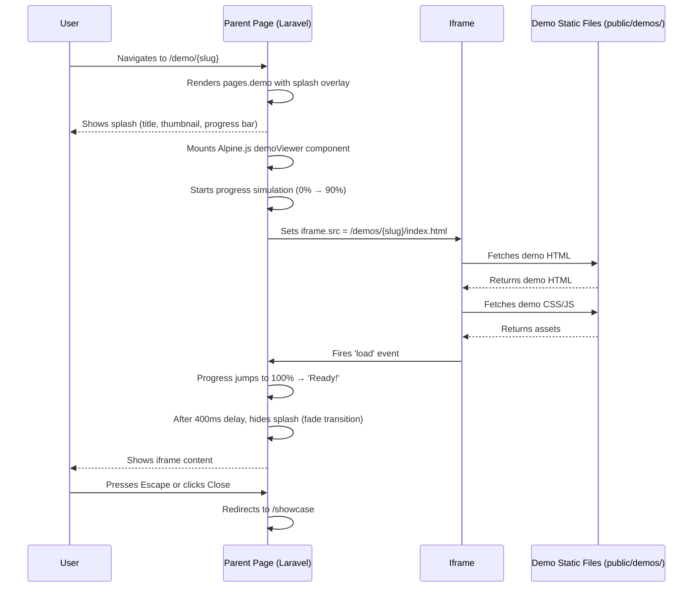
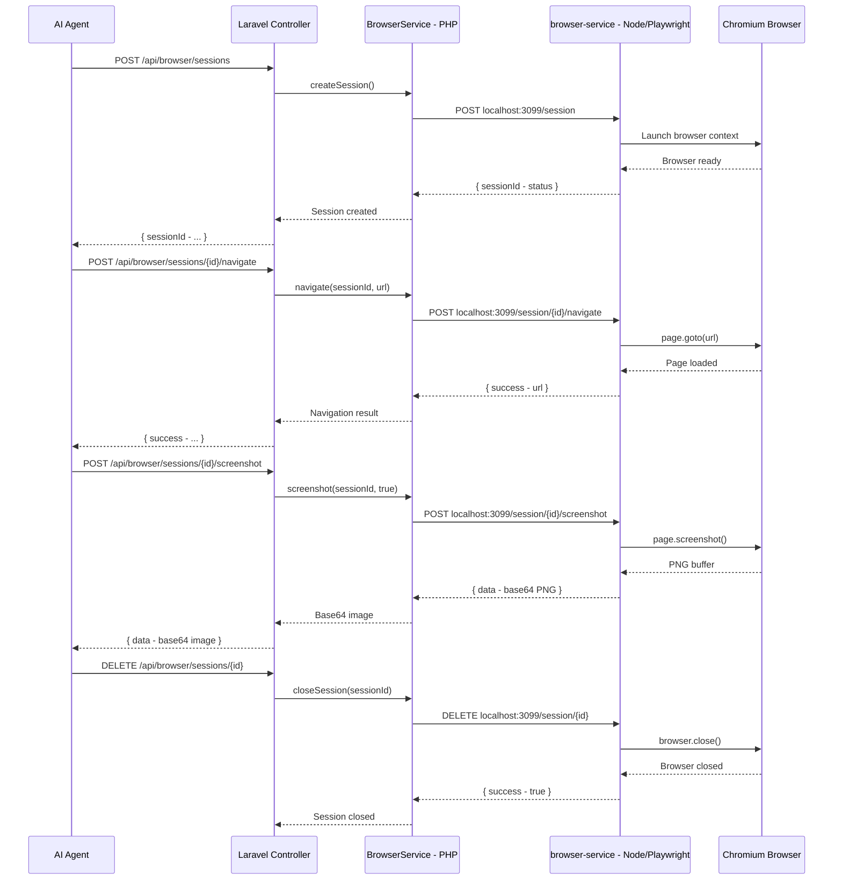
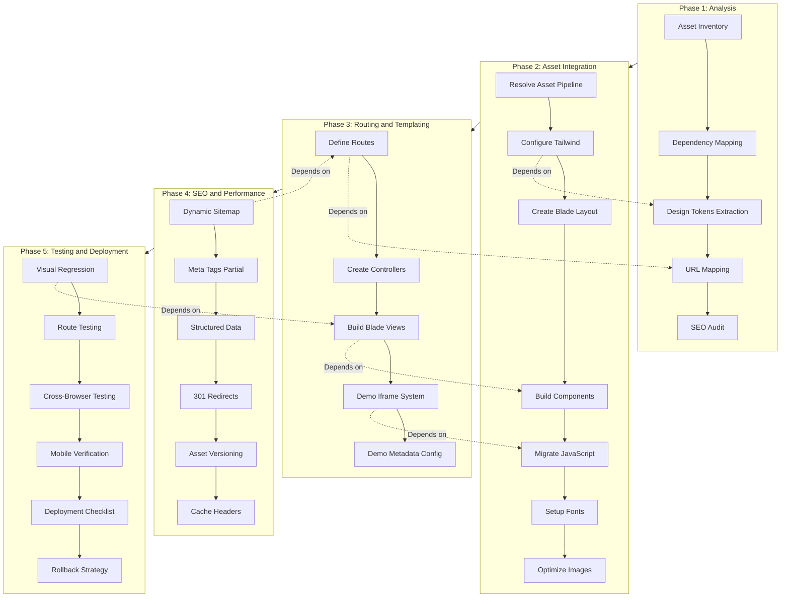

# Chada Digital — Static-to-Laravel Migration Plan

> **Version**: 1.0
> **Target**: Laravel 12 + Tailwind CSS v3 + Alpine.js + Laravel Mix
> **Source**: `chada-digital-static/` — vanilla HTML/SCSS/JS
> **Goal**: Fully functional Laravel application matching the static site, with iframe-based demo embedding

---

## Table of Contents

1. [Executive Summary](#executive-summary)
2. [Timeline Summary](#timeline-summary)
3. [Current State Analysis](#current-state-analysis)
4. [Phase 1: Analysis and Audit](#phase-1-analysis-and-audit)
5. [Phase 2: Asset Integration](#phase-2-asset-integration)
6. [Phase 3: Routing, Templating & Browser Automation](#phase-3-routing-and-templating)
    - [3.6 Playwright Browser Automation System](#36-playwright-browser-automation-system)
7. [Phase 4: SEO and Performance Optimization](#phase-4-seo-and-performance-optimization)
8. [Phase 5: Testing and Deployment](#phase-5-testing-and-deployment)
9. [Dependency Map](#dependency-map)
10. [Risk Assessment](#risk-assessment)
11. [Decision Records](#decision-records)

---

## Timeline Summary

> **Note:** These are single-developer estimates. Tasks within each phase can be parallelized across multiple developers to reduce total duration.

| Phase | Estimated Duration | Dependencies |
|---|---|---|
| Phase 1: Analysis & Audit | 0.5–1 day | None |
| Phase 2: Asset Integration | 2–3 days | Phase 1 |
| Phase 3: Routing & Templating | 2–3 days | Phase 2 |
| Phase 4: SEO & Performance Optimization | 1–2 days | Phase 3 |
| Phase 5: Testing & Deployment | 1–2 days | Phase 4 |
| **Total** | **6.5–11 days** | |

---

## Executive Summary

This document provides a step-by-step technical migration plan for transitioning the Chada Digital static website into a Laravel 12 application. The static site consists of 2 core pages (`index.html`, `showcase.html`), a `404.html`, 5 demo projects (16 sub-pages total), CSS/JS assets, and SCSS source files.

The Laravel application will preserve all existing functionality while adding Blade templating, named routes, an iframe-based demo embedding system, dynamic SEO management, and a proper asset pipeline via Laravel Mix with Tailwind CSS v3.

---

## Current State Analysis

### Static Site (`chada-digital-static/`)

| Category | Details |
|---|---|
| **Core Pages** | `index.html` (567 lines), `showcase.html` (166 lines), `404.html` (35 lines) |
| **CSS** | `tailwind.css` (200KB minified — Tailwind v3 full build), `custom.css` (compiled SCSS output) |
| **JavaScript** | `main.js` (375 lines — toast notifications, mobile nav, contact form, footer year, projects modal), `showcase.js` (113 lines — filter/sort, detail modal) |
| **SCSS Source** | `main.scss`, `_contact-form.scss` (form validation styles), `_showcase.scss` (animations, filter button active states) |
| **Fonts** | Outfit (headings/display), Inter (body), Playfair Display (accent) — via Google Fonts CDN with `preconnect`/`dns-prefetch` |
| **Images** | 17 images in `assets/images/` (hero, project thumbnails, Sterling & Vale sub-page assets) |
| **Favicon/Icons** | `favicon.ico`, `favicon-32.png`, `apple-touch-icon.png`, `og-image.jpg`, `chada-logo-horizontal.png`, `chada-mark.png` |
| **SEO** | Comprehensive meta tags, Open Graph, Twitter Cards, JSON-LD structured data (Organization + WebSite), `robots.txt`, `sitemap.xml` (6 URLs) |

### Design Tokens (Inferred from Static HTML)

| Token | Value | Tailwind Mapping |
|---|---|---|
| **Primary** | `#3b82f6` (blue-500) | `primary`, `primary-foreground` |
| **Background** | `#0e1b2e` (dark navy) | `background` |
| **Card Background** | `#0b1526`, `bg-card/40` | `card` |
| **Border** | `rgba(255,255,255,0.08)` (translucent) | `border` |
| **Text Primary** | white-ish | `foreground` |
| **Text Muted** | `rgba(148,163,184,1)` | `muted-foreground` |
| **Font — Display** | Outfit | `font-display` |
| **Font — Body** | Inter | `font-sans` |
| **Font — Accent** | Playfair Display | `font-accent` |
| **Theme Color** | `#0e1b2e` | `<meta name="theme-color">` |
| **Border Radius** | `0.75rem` (rounded-xl), `1rem` (rounded-2xl), `9999px` (rounded-full) | Standard Tailwind |

### Demo Sites (5 Total, 16 Sub-pages)

| Demo | Type | Sub-pages | CSS/JS |
|---|---|---|---|
| **ApexFlow** | SaaS | index, dashboard, login, signup, pricing | Independent `styles.css` + `main.js` |
| **Elysian** | Hotel | index, booking, contact, room, rooms | Independent `styles.css` + `main.js` |
| **HIREBASE** | Job Board | index, job, jobs | Independent `styles.css` + `main.js` |
| **NOIR** | E-commerce | index, cart, checkout, product, shop | Independent `styles.css` + `main.js` |
| **Sterling & Vale** | Architecture | index, about, contact, projects, services | Reuses main site `tailwind.css` + `main.js` |

### Laravel App (Root)

| Category | Details |
|---|---|
| **Version** | Laravel 12 (`laravel/framework: ^12.0`) |
| **PHP** | ^8.2 |
| **Asset Pipeline** | Laravel Mix with Tailwind CSS v3 via PostCSS |
| **Build Config** | [`webpack.mix.js`](webpack.mix.js:1) configured for Mix + Tailwind CSS via PostCSS — **already set up and working** |
| **Tailwind Config** | [`tailwind.config.js`](tailwind.config.js:1) — empty `extend: {}`, no custom theme |
| **Routes** | [`routes/web.php`](routes/web.php:1) — single route `'/'` returning `welcome` view |
| **Welcome View** | [`welcome.blade.php`](resources/views/welcome.blade.php:1) — default Laravel starter with Instrument Sans, Tailwind v4 inline |
| **SCSS Entry** | [`resources/sass/app.scss`](resources/sass/app.scss:1) — empty |
| **JS Entry** | [`resources/js/app.js`](resources/js/app.js:1) — imports bootstrap.js (Axios only) |
| **Public Assets** | Already contains a copy of static assets (CSS, JS, images, demos) from a prior partial copy |

---

## Phase 1: Analysis and Audit

### 1.1 Complete Asset Inventory

**CSS Assets:**
- [`chada-digital-static/assets/css/tailwind.css`](chada-digital-static/assets/css/tailwind.css) — 200KB minified Tailwind v3 with Chada design tokens pre-configured in the build
- [`chada-digital-static/assets/css/custom.css`](chada-digital-static/assets/css/custom.css) — Compiled SCSS output (contact form validation styles, showcase animations, filter button states)

**JavaScript Assets:**
- [`chada-digital-static/assets/js/main.js`](chada-digital-static/assets/js/main.js) — 375 lines, vanilla JS: toast notifications, mobile nav (2 instances), contact form (2 forms), footer year, projects modal with focus trapping
- [`chada-digital-static/assets/js/showcase.js`](chada-digital-static/assets/js/showcase.js) — 113 lines, vanilla JS: filter/sort with active state toggling, project detail modal with Escape key support

**Images (17 total):**
- `hero-devices.jpg` — Hero section graphic
- `project-{apexflow,corporate,elysian,fintech,food,hirebase,noir,realestate,sterling}.jpg` — Project thumbnails (9)
- `sterling-{about,hero,project-1..project-6}.jpg` — Sterling & Vale demo assets (7)

**Third-Party Dependencies:**
- Google Fonts (Outfit, Inter, Playfair Display) — loaded via CDN
- **No JavaScript framework dependencies** — pure vanilla JS
- **No npm runtime dependencies** in the static site

### 1.2 Dependency Mapping

| Page | CSS | JS | Images |
|---|---|---|---|
| `index.html` | `tailwind.css`, `custom.css` | `main.js` | hero-devices, project thumbnails (3), logo, favicon |
| `showcase.html` | `tailwind.css`, `custom.css` | `showcase.js` | project thumbnails (3), logo, favicon |
| `404.html` | `tailwind.css`, `custom.css` | none | logo, favicon |
| Sterling & Vale demo | `tailwind.css` | `main.js` | sterling-* images (7), logo |

**Note:** ApexFlow, Elysian, HIREBASE, and NOIR demos have fully independent CSS/JS — no dependency on the main site's assets whatsoever.

### 1.3 Design System Extraction

Based on the static HTML's Tailwind utility classes, the following custom theme should be defined:

```js
// Proposed tailwind.config.js
module.exports = {
  content: [
    "./resources/**/*.blade.php",
    "./resources/**/*.js",
  ],
  theme: {
    extend: {
      colors: {
        background: '#0e1b2e',
        foreground: '#f8fafc',
        card: {
          DEFAULT: '#0b1526',
          foreground: '#f8fafc',
        },
        primary: {
          DEFAULT: '#3b82f6',
          foreground: '#ffffff',
        },
        muted: {
          DEFAULT: '#1e293b',
          foreground: '#94a3b8',
        },
        border: 'rgba(148, 163, 184, 0.1)',
      },
      fontFamily: {
        display: ['Outfit', 'sans-serif'],
        sans: ['Inter', 'sans-serif'],
        accent: ['Playfair Display', 'serif'],
      },
      borderRadius: {
        '2xl': '1rem',
      },
    },
  },
  plugins: [],
};
```

### 1.4 URL Structure Mapping

| Static URL | Laravel Route | View |
|---|---|---|
| `/` (`index.html`) | `Route::get('/', ...)` → `home` | `pages.home` |
| `/showcase.html` | `Route::get('/showcase', ...)` → `showcase` | `pages.showcase` |
| `/404.html` | Fallback route | `errors.404` |
| `/demos/{slug}` | `Route::get('/demo/{slug}', ...)` → `demo.show` | `pages.demo` |
| `/demos/{slug}/{subpage}` | `Route::get('/demo/{slug}/{subpage}', ...)` → `demo.subpage` | `pages.demo` |

**301 Redirect Map:**

| Old URL | New URL | Reason |
|---|---|---|
| `/showcase.html` | `/showcase` | Remove `.html` extension |

Since only 2 core HTML pages exist, the redirect surface is minimal.

### 1.5 SEO Audit

The static site has strong SEO already:

- **Meta tags**: `description`, `robots`, `referrer`, `author`, `copyright`, `theme-color`
- **Open Graph**: `og:url`, `og:site_name`, `og:title`, `og:description`, `og:type`, `og:locale`, `og:image` (with width/height/alt)
- **Twitter Cards**: `twitter:card`, `twitter:title`, `twitter:description`, `twitter:image`
- **JSON-LD**: Organization + LocalBusiness, WebSite (structured data)
- **Canonical URLs**: Present on all pages
- **`hreflang`**: `en_NG`, `x-default`
- **`robots.txt`**: Allow all, sitemap reference
- **`sitemap.xml`**: 6 URLs (only homepage + Sterling & Vale sub-pages — **needs expansion**)

**Gaps identified:**
- Sitemap only covers 6 URLs; should include showcase, all demo pages
- No `lang` attribute on `<html>` is dynamic (hardcoded `en`)
- Missing structured data for individual projects (potential `CreativeWork`)

### 1.6 Performance Baseline

| Metric | Target |
|---|---|
| Lighthouse Performance | 90+ |
| Lighthouse Accessibility | 95+ |
| Lighthouse Best Practices | 95+ |
| Lighthouse SEO | 100 |
| First Contentful Paint | < 1.5s |
| Largest Contentful Paint | < 2.5s |
| Total Blocking Time | < 200ms |
| Cumulative Layout Shift | < 0.1 |

**Current observations:**
- `tailwind.css` is 200KB minified — already optimized
- Fonts use `preconnect`/`dns-prefetch` — good practice
- Images lack explicit `width`/`height` attributes in some places
- No critical CSS inlining

---

## Phase 2: Asset Integration

### 2.1 Asset Pipeline Setup — Laravel Mix Configuration

**Status:** The project already has a working Laravel Mix configuration. The [`webpack.mix.js`](webpack.mix.js:1) is configured to compile SCSS with Tailwind CSS v3 via PostCSS and bundle JavaScript. The existing setup should be retained and cleaned up rather than replaced.

**Decision: Use Laravel Mix** (see [Decision Record 1](#dr1))

**Existing configuration in** [`webpack.mix.js`](webpack.mix.js:1):
```js
const mix = require('laravel-mix');

mix.js('resources/js/app.js', 'public/js')
   .sass('resources/sass/app.scss', 'public/css', {}, [
       require('tailwindcss'),
       require('autoprefixer'),
   ])
   .webpackConfig({
       module: {
           rules: [
               {
                   test: /\.js$/,
                   type: 'javascript/auto'
               }
           ]
       }
   });
```

**Existing `package.json` scripts** (use `bun` as the package manager):
```json
{
  "scripts": {
    "dev": "bun x mix",
    "watch": "bun x mix watch",
    "prod": "bun x mix --production"
  }
}
```

**Steps:**

1. **Remove the conflicting Vite dependency:**
   ```bash
   bun remove @tailwindcss/vite
   ```
   The `@tailwindcss/vite` package (Tailwind v4 plugin) was added alongside the existing Mix + Tailwind v3 setup and is not used.

2. **Verify existing Mix dependencies** are correct:
   ```bash
   bun install
   ```
   Key dependencies already present:
   - `laravel-mix` (^6.0.49) — build orchestrator
   - `tailwindcss` (^3.4.19) — utility CSS framework
   - `sass` (^1.69.5) + `sass-loader` (^13.3.2) — SCSS compilation
   - `postcss` (^8.4.31) + `autoprefixer` (^10.5.2) — CSS post-processing
   - `webpack` (5.88.2) + `webpack-cli` (^5.1.4) — underlying bundler
   - `axios` (^1.11.0) — HTTP client
   - `resolve-url-loader` (^5.0.0) — SCSS URL resolution
   - `concurrently` (^9.0.1) — parallel script execution

3. **Add Alpine.js dependencies:**
   ```bash
   bun add alpinejs
   bun add @alpinejs/focus
   ```

4. **Keep** [`webpack.mix.js`](webpack.mix.js:1) as-is — no changes needed. The `mix.js()` call compiles `resources/js/app.js` → `public/js/app.js`, and `mix.sass()` compiles `resources/sass/app.scss` → `public/css/app.css` with Tailwind CSS via PostCSS.

5. **Keep SCSS workflow.** The existing SCSS setup in `resources/sass/` should be retained. SCSS source files stay in [`resources/sass/`](resources/sass/) and compile to [`public/css/`](public/css/). The `_contact-form.scss` and `_showcase.scss` partials should be moved from `chada-digital-static/scss/` into `resources/sass/` and imported into `app.scss`.

6. **Update** [`tailwind.config.js`](tailwind.config.js:1) with Chada design tokens (see Section 1.3)

7. **The `public/mix-manifest.json`** already exists and will be regenerated by Mix on each build. Mix with `mix.version()` (see Phase 4.5) produces hashed filenames tracked in this manifest.

8. **Development workflow:**
   ```bash
   bun run dev       # single build (mix)
   bun run watch     # watch mode with auto-rebuild (mix watch)
   bun run prod      # production build with minification (mix --production)
   ```

9. **Blade integration:** Use Laravel's `mix()` helper (available globally in Blade) to reference compiled assets:
   ```blade
   <link rel="stylesheet" href="{{ mix('css/app.css') }}">
   <script src="{{ mix('js/app.js') }}"></script>
   ```
   This helper reads `mix-manifest.json` and returns the correct hashed filename, enabling cache busting.

10. **Optional: BrowserSync** for development. Add to [`webpack.mix.js`](webpack.mix.js:1):
    ```js
    mix.browserSync('chada-digital.test');
    ```

11. **Sterling & Vale — Resolve tailwind.css dependency:** The Sterling & Vale demo (`public/demos/sterling-vale/`) references `../../assets/css/tailwind.css` (the main site's Tailwind build), unlike the other 4 demos which have fully independent CSS. To make it self-contained:
    ```bash
    # Copy the static site's tailwind.css into the Sterling & Vale demo directory
    cp chada-digital-static/assets/css/tailwind.css public/demos/sterling-vale/assets/css/tailwind.css
    
    # Update all Sterling & Vale HTML files to reference the local copy:
    # Change: href="../../assets/css/tailwind.css"
    # To:     href="assets/css/tailwind.css"
    ```
    Files to update: `sterling-vale/index.html`, `sterling-vale/about/index.html`, `sterling-vale/contact/index.html`, `sterling-vale/projects/index.html`, `sterling-vale/services/index.html`

### 2.2 Configure Tailwind with Chada Design Tokens

**Steps:**

1. Replace the contents of [`tailwind.config.js`](tailwind.config.js:1) with the design token configuration from Section 1.3

2. **Update** [`resources/sass/app.scss`](resources/sass/app.scss) with Tailwind directives and custom styles:
   ```scss
   @tailwind base;
   @tailwind components;
   @tailwind utilities;

   /* Contact form custom styles */
   .chada-honeypot {
     position: absolute;
     overflow: hidden;
     clip: rect(0 0 0 0);
     height: 1px;
     width: 1px;
     margin: -1px;
     padding: 0;
     border: 0;
   }

   .chada-field-input.is-invalid {
     @apply border-red-500 focus:border-red-500 focus:ring-red-500;
   }

   .chada-error-msg:empty,
   #chada-form-error:empty {
     display: none;
   }

   /* Showcase page styles */
   @keyframes fadeIn {
     from { opacity: 0; transform: translateY(20px); }
     to { opacity: 1; transform: translateY(0); }
   }

   .animate-fade-in {
     animation: fadeIn 0.5s ease-out;
   }

   .filter-btn[data-active='true'] {
     @apply border-blue-500 bg-blue-500/20 text-blue-500;
   }
   ```

### 2.3 Extract Blade Master Layout

Create [`resources/views/layouts/app.blade.php`](resources/views/layouts/app.blade.php):

**Structure:**
```blade
<!doctype html>
<html lang="{{ str_replace('_', '-', app()->getLocale()) }}">
<head>
    {{-- Meta, SEO, Fonts, Mix assets — see Phase 4 for full SEO --}}
    @include('partials.meta')
    @include('partials.fonts')
    <link rel="stylesheet" href="{{ mix('css/app.css') }}">
    @stack('head')
</head>
<body class="bg-background text-foreground antialiased">
    @include('partials.header')
    
    <main>
        @yield('content')
    </main>
    
    @include('partials.footer')
    @include('partials.projects-modal')
    
    <script src="{{ mix('js/app.js') }}"></script>
    @stack('scripts')
</body>
</html>
```

**Key design decisions:**
- Use `@include` for header/footer/meta/fonts (partials)
- Use `@yield('content')` for page-specific content (not `$slot` — simpler)
- Use `@stack('head')` and `@stack('scripts')` for page-specific injections
- Laravel's `mix()` helper reads `mix-manifest.json` and handles CSS/JS versioning automatically

### 2.4 Create Reusable Blade Components

All components use Laravel Blade partials (not anonymous Blade components with `@props` unless complexity warrants it).

**Partials to create in `resources/views/partials/`:**

| Partial | File | Source | Notes |
|---|---|---|---|
| Meta tags | [`partials/meta.blade.php`](resources/views/partials/meta.blade.php) | [`index.html:1-84`](chada-digital-static/index.html:1) | Dynamic title, description, OG, canonical |
| Fonts | [`partials/fonts.blade.php`](resources/views/partials/fonts.blade.php) | [`index.html:36-42`](chada-digital-static/index.html:36) | `preconnect`/`dns-prefetch`, Google Fonts link |
| Header | [`partials/header.blade.php`](resources/views/partials/header.blade.php) | [`index.html:88-124`](chada-digital-static/index.html:88) | Sticky nav, mobile toggle, desktop nav links, CTA button |
| Footer | [`partials/footer.blade.php`](resources/views/partials/footer.blade.php) | [`index.html:446-484`](chada-digital-static/index.html:446) | 4-column grid, logo, links, copyright with dynamic year |
| Hero Section | [`partials/hero.blade.php`](resources/views/partials/hero.blade.php) | [`index.html:128-150`](chada-digital-static/index.html:128) | Gradient blobs, heading, CTAs |
| Project Cards | [`partials/project-card.blade.php`](resources/views/partials/project-card.blade.php) | [`index.html:258-288`](chada-digital-static/index.html:258) | Reusable card with image, overlay, title, description |
| Projects Modal | [`partials/projects-modal.blade.php`](resources/views/partials/projects-modal.blade.php) | [`index.html:488-562`](chada-digital-static/index.html:488) | Full grid modal, focus trapping |
| Contact Form | [`partials/contact-form.blade.php`](resources/views/partials/contact-form.blade.php) | [`index.html:396-440`](chada-digital-static/index.html:396) | Form with honeypot, validation, success state |
| Toast Container | [`partials/toast-root.blade.php`](resources/views/partials/toast-root.blade.php) | N/A (JS-created) | Empty `#toast-root` div, Alpine-reactive |
| About Section | [`partials/about.blade.php`](resources/views/partials/about.blade.php) | [`index.html:153-182`](chada-digital-static/index.html:153) | "Trusted Digital Solutions For" section |
| Services Section | [`partials/services.blade.php`](resources/views/partials/services.blade.php) | [`index.html:184-228`](chada-digital-static/index.html:184) | "What We Do" service cards grid |
| Portfolio Section | [`partials/portfolio.blade.php`](resources/views/partials/portfolio.blade.php) | [`index.html:230-295`](chada-digital-static/index.html:230) | "Featured Projects" with project cards |
| Products Section | [`partials/products.blade.php`](resources/views/partials/products.blade.php) | [`index.html:297-354`](chada-digital-static/index.html:297) | "Products & Solutions" cards |
| Contact Section | [`partials/contact.blade.php`](resources/views/partials/contact.blade.php) | [`index.html:356-444`](chada-digital-static/index.html:356) | Contact form wrapper with heading and details |
| Showcase Project Card | [`partials/showcase-project-card.blade.php`](resources/views/partials/showcase-project-card.blade.php) | N/A (extracted from showcase) | Individual project card for `/showcase` grid |

**Blade anonymous components for smaller UI elements:**

| Component | Tag | Purpose |
|---|---|---|
| Primary Button | `<x-button-primary href="#contact">` | `rounded-full bg-primary` CTA button |
| Outline Button | `<x-button-outline href="#portfolio">` | `rounded-full border border-primary/40` secondary button |
| Section Badge | `<x-section-badge>Our Work</x-section-badge>` | `text-xs font-semibold uppercase tracking-[0.3em] text-primary` |
| Section Heading | `<x-section-heading>Featured <span class="text-primary">Projects</span></x-section-heading>` | `font-display text-3xl font-bold` H2 |
| Service Card | `<x-service-card icon="..." title="..." description="..." />` | Icon, title, description, Learn More link |
| Product Card | `<x-product-card icon="..." title="..." description="..." />` | Same pattern as service card |

### 2.5 Consolidate JavaScript into Modular ES6 with Alpine.js

**Strategy:** Move from vanilla JS to Alpine.js for reactive UI behavior while keeping complex logic (form submission, modals, focus trapping) in modular ES6. Mix bundles all JS through [`resources/js/app.js`](resources/js/app.js) as the main entry point.

**New JS structure under `resources/js/`:**

```
resources/js/
├── app.js                  # Entry point — imports all modules, initializes Alpine
├── bootstrap.js            # Axios setup (keep existing)
├── modules/
│   ├── toast.js            # Toast notification system (ported from main.js:13-70)
│   ├── mobile-nav.js       # Mobile nav toggle (ported from main.js:78-106)
│   ├── contact-form.js     # Contact form validation + submission (ported from main.js:112-213)
│   ├── projects-modal.js   # Projects modal with focus trapping (ported from main.js:268-361)
│   └── demo-viewer.js      # Iframe embedding system with splash overlay (new)
├── alpine/
│   ├── header.js           # Alpine data for mobile nav state
│   ├── showcase.js         # Alpine data for filter/sort (ported from showcase.js)
│   └── contact.js          # Alpine data for form state management
```

**Mix bundling approach:**

[`webpack.mix.js`](webpack.mix.js:1) already compiles `resources/js/app.js` → `public/js/app.js`. All modules (Alpine, `demo-viewer.js`, etc.) should be imported into `app.js` via ES6 `import`. For separate bundles (e.g., compiling `demo-viewer.js` independently), add another `mix.js()` call:

```js
// In webpack.mix.js — add a second entry point for showcase-specific JS if needed:
mix.js('resources/js/app.js', 'public/js')
   .js('resources/js/demo-viewer.js', 'public/js')  // separate bundle
   .sass('resources/sass/app.scss', 'public/css', {}, [
       require('tailwindcss'),
       require('autoprefixer'),
   ]);
```

**Key JS migrations:**

| Static JS | Laravel Approach |
|---|---|
| `initMobileNav()` | Alpine.js `x-data` + `x-show` for toggle; keep `initMobileNav()` as module for Sterling & Vale demo compatibility |
| `initChadaContactForm()` | Alpine.js for form state (loading, errors, success); Axios for submission to `/api/contact` |
| `initProjectsModal()` | Alpine.js `x-show` + `x-trap` (focus plugin) for modal |
| `initFooterYear()` | Blade `{{ date('Y') }}` in footer partial (no JS needed) |
| `toast()` | Keep as exported function in `toast.js` module |
| Filter buttons (showcase) | Alpine.js `x-data` with reactive `selectedCategory` |

**Alpine.js plugins to install and register:**

1. Install Alpine.js and the focus plugin (listed in Phase 2.1 step 3):
   ```bash
   bun add alpinejs
   bun add @alpinejs/focus
   ```

2. Import and register in [`resources/js/app.js`](resources/js/app.js):
   ```js
   import Alpine from 'alpinejs';
   import focus from '@alpinejs/focus';
   
   Alpine.plugin(focus);
   window.Alpine = Alpine;
   Alpine.start();
   ```

3. Usage: `x-trap` is now available on any Alpine.js `x-data` element. Apply `x-trap` on modal containers for automatic focus trapping:
   ```blade
   <!-- Projects Modal -->
   <div x-data="{ open: false }" x-show="open" x-trap="open">
       {{-- Modal content — focus cycles within this container --}}
   </div>
   
   <!-- Demo splash screen close button -->
   <div x-show="showSplash" x-trap="showSplash" @keydown.escape.window="close()">
       {{-- Splash content --}}
   </div>
   ```

### 2.6 Font Management

**Decision: Keep Google Fonts CDN** (see [Decision Record 3](#dr3))

The existing setup with `preconnect` to `fonts.googleapis.com` and `fonts.gstatic.com`, plus `dns-prefetch`, is already well-optimized. Add the `display=swap` parameter (already present).

Place in [`resources/views/partials/fonts.blade.php`](resources/views/partials/fonts.blade.php):

```blade
<link rel="preconnect" href="https://fonts.googleapis.com">
<link rel="preconnect" href="https://fonts.gstatic.com" crossorigin>
<link rel="dns-prefetch" href="https://fonts.googleapis.com">
<link rel="dns-prefetch" href="https://fonts.gstatic.com">
<link rel="preload" href="https://fonts.googleapis.com/css2?family=Outfit:wght@400;500;600;700;800&family=Inter:wght@400;500;600&family=Playfair+Display:wght@500;600;700;800&display=swap" as="style">
<link rel="stylesheet" href="https://fonts.googleapis.com/css2?family=Outfit:wght@400;500;600;700;800&family=Inter:wght@400;500;600&family=Playfair+Display:wght@500;600;700;800&display=swap">
```

### 2.7 Image Optimization Strategy

**Steps:**

1. **Move all images** from `chada-digital-static/assets/images/` to `public/assets/images/` (already partially done)

2. **Convert key images to WebP** with fallback:
   - Hero image (`hero-devices.jpg`)
   - Project thumbnails (9 images)
   - Implement using `<picture>` element or accept JPG quality for simplicity

3. **Add explicit `width` and `height` attributes** to all `` tags to prevent CLS:
   - Project thumbnails: `aspect-[4/3]` → `width="800" height="600"`
   - Hero: determine from actual image dimensions

4. **Ensure `loading="lazy"`** on all below-the-fold images (already present on project thumbnails)

5. **Add `fetchpriority="high"`** on the hero image

6. **Leverage Mix's versioning** for cache busting — `mix.version()` generates hashed filenames tracked in `mix-manifest.json`. The `mix()` helper in Blade automatically resolves the correct hashed URL.

**Decision: Keep images in `public/` rather than Mix-processed** — since these are content images referenced in HTML (not CSS/JS imports), they should remain in `public/` for direct URL access. Mix processing is optimal for CSS/JS assets only.

---

## Phase 3: Routing and Templating

### 3.1 Define All Routes

Update [`routes/web.php`](routes/web.php:1):

```php
<?php

use App\Http\Controllers\PageController;
use App\Http\Controllers\DemoController;
use App\Http\Controllers\ContactController;
use Illuminate\Support\Facades\Route;

// Home page
Route::get('/', [PageController::class, 'home'])->name('home');

// Showcase / Portfolio page
Route::get('/showcase', [PageController::class, 'showcase'])->name('showcase');

// Redirect legacy .html URLs
Route::redirect('/showcase.html', '/showcase', 301);

// Demo viewer — main demo page
Route::get('/demo/{slug}', [DemoController::class, 'show'])->name('demo.show');

// Demo viewer — sub-page within a demo
Route::get('/demo/{slug}/{subpage}', [DemoController::class, 'subpage'])
    ->where('subpage', '.*')
    ->name('demo.subpage');

// Contact form submission
Route::post('/api/contact', [ContactController::class, 'submit'])->name('contact.submit');

// Dynamic sitemap
Route::get('/sitemap.xml', [PageController::class, 'sitemap'])->name('sitemap');
```

### 3.2 Create Controllers

**`app/Http/Controllers/PageController.php`:**

```php
<?php

namespace App\Http\Controllers;

use Illuminate\View\View;
use Illuminate\Http\Response;

class PageController extends Controller
{
    public function home(): View
    {
        return view('pages.home', [
            'meta' => [
                'title' => 'Chada Digital — Digital Solutions That Scale Businesses',
                'description' => 'We engineer high-performance websites, command-attention brands, and intelligent automation for ambitious teams across Nigeria and beyond.',
                'canonical' => route('home'),
                'ogImage' => asset('og-image.jpg'),
            ],
        ]);
    }

    public function showcase(): View
    {
        return view('pages.showcase', [
            'meta' => [
                'title' => 'Chada Digital — Digital Solutions That Scale Businesses',
                'description' => 'A selection of recent work across industries and use cases.',
                'canonical' => route('showcase'),
                'ogImage' => asset('og-image.jpg'),
            ],
        ]);
    }

    public function sitemap(): Response
    {
        // Generate dynamic sitemap — see Phase 4
    }
}
```

**`app/Services/DemoService.php`** — Dedicated service for demo metadata retrieval:

```php
<?php

namespace App\Services;

use Illuminate\Support\Collection;

class DemoService
{
    /**
     * All registered demos with their metadata.
     * This is the single source of truth for demo data used by
     * DemoController, PageController (sitemap), and any future consumers.
     */
    public function all(): array
    {
        return [
            'apexflow' => [
                'title' => 'ApexFlow',
                'description' => 'SaaS Platform — AI Automation',
                'thumbnail' => '/assets/images/project-apexflow.jpg',
                'category' => 'SaaS',
            ],
            'elysian' => [
                'title' => 'ELYSIAN',
                'description' => 'Booking — Hotel & Spa',
                'thumbnail' => '/assets/images/project-elysian.jpg',
                'category' => 'Booking',
            ],
            'hirebase' => [
                'title' => 'HIREBASE',
                'description' => 'Recruitment — Job Board Platform',
                'thumbnail' => '/assets/images/project-hirebase.jpg',
                'category' => 'Recruitment',
            ],
            'noir' => [
                'title' => 'NOIR',
                'description' => 'E-Commerce — Fashion Store',
                'thumbnail' => '/assets/images/project-noir.jpg',
                'category' => 'E-commerce',
            ],
            'sterling-vale' => [
                'title' => 'Sterling & Vale',
                'description' => 'Construction Firm — Corporate Website',
                'thumbnail' => '/assets/images/project-sterling.jpg',
                'category' => 'Construction',
            ],
        ];
    }

    /**
     * Check if a demo slug is registered.
     */
    public function exists(string $slug): bool
    {
        return array_key_exists($slug, $this->all());
    }

    /**
     * Get metadata for a single demo, or null if not found.
     */
    public function get(string $slug): ?array
    {
        return $this->all()[$slug] ?? null;
    }

    /**
     * Get all demo metadata as a Collection (useful for Blade views).
     */
    public function collection(): Collection
    {
        return collect($this->all());
    }
}
```

Register the service in [`AppServiceProvider`](app/Providers/AppServiceProvider.php):
```php
use App\Services\DemoService;

public function register(): void
{
    $this->app->singleton(DemoService::class);
}
```

**`app/Http/Controllers/DemoController.php`** (refactored to inject DemoService):

```php
<?php

namespace App\Http\Controllers;

use App\Services\DemoService;
use Illuminate\View\View;
use Illuminate\Http\Response;
use Illuminate\Support\Facades\File;

class DemoController extends Controller
{
    public function __construct(
        protected DemoService $demoService
    ) {}

    public function show(string $slug): View|Response
    {
        $demo = $this->demoService->get($slug);

        if (!$demo) {
            abort(404);
        }

        $demoPath = public_path("demos/{$slug}");

        if (!File::exists($demoPath)) {
            abort(404);
        }

        return view('pages.demo', [
            'demo' => $demo,
            'slug' => $slug,
            'meta' => [
                'title' => "{$demo['title']} — Chada Digital Demo",
                'description' => $demo['description'],
                'canonical' => route('demo.show', $slug),
                'ogImage' => asset($demo['thumbnail']),
            ],
        ]);
    }

    public function subpage(string $slug, string $subpage): View|Response
    {
        $demo = $this->demoService->get($slug);

        if (!$demo) {
            abort(404);
        }

        $subpagePath = public_path("demos/{$slug}/{$subpage}");

        // If subpage path has no .html, try index.html
        if (!File::exists($subpagePath)) {
            $subpagePath = public_path("demos/{$slug}/{$subpage}/index.html");
        }

        if (!File::exists($subpagePath)) {
            abort(404);
        }

        return view('pages.demo', [
            'demo' => $demo,
            'slug' => $slug,
            'subpage' => $subpage,
            'meta' => [
                'title' => "{$demo['title']} — Chada Digital Demo",
                'description' => $demo['description'],
                'canonical' => route('demo.subpage', ['slug' => $slug, 'subpage' => $subpage]),
                'ogImage' => asset($demo['thumbnail']),
            ],
        ]);
    }
}
```

> **Note:** The `$demos` array has been extracted into [`DemoService`](app/Services/DemoService.php) to avoid duplication between `DemoController` and `PageController` (sitemap). The `DemoController` now injects `DemoService` via constructor promotion and delegates all metadata retrieval to it. This is consistent with Laravel's service pattern and makes the metadata available to any part of the application.

**`app/Http/Controllers/ContactController.php`:**

```php
<?php

namespace App\Http\Controllers;

use Illuminate\Http\Request;
use Illuminate\Http\JsonResponse;

class ContactController extends Controller
{
    public function submit(Request $request): JsonResponse
    {
        $validated = $request->validate([
            'name' => 'required|string|max:255',
            'email' => 'required|email|max:255',
            'message' => 'required|string|max:5000',
        ]);

        // Honeypot check
        if ($request->filled('bot-field')) {
            return response()->json(['message' => 'Thank you!'], 200); // Silent reject
        }

        // TODO: Send email notification via Laravel Mail
        // Mail::to('info@chadadigital.com')->send(new ContactFormSubmission($validated));

        return response()->json(['message' => 'Message sent successfully!'], 200);
    }
}
```

> **⚠️ Deferred Implementation:** The email sending logic (`Mail::to(...)->send(...)`) is intentionally deferred to a later phase and is **out of scope for this migration plan**. The current implementation returns a successful JSON response for testing purposes. The deployment checklist (Phase 5.5) includes a configuration item to verify the contact form endpoint returns 200 — but actual email delivery should be implemented and tested in a follow-up task. The [`ContactFormSubmission`](app/Mail/ContactFormSubmission.php) mailable class, mail configuration (`MAIL_*` env vars), and the `Mail::to()` call in the controller will need to be completed at that time.

### 3.3 Create Blade Views

**`resources/views/pages/home.blade.php`:**

```blade
@extends('layouts.app')

@section('content')
    @include('partials.hero')
    @include('partials.about')       {{-- Trusted Digital Solutions For section --}}
    @include('partials.services')    {{-- What We Do section --}}
    @include('partials.portfolio')   {{-- Featured Projects section --}}
    @include('partials.products')    {{-- Products & Solutions section --}}
    @include('partials.contact')     {{-- Contact form section --}}
@endsection
```

**`resources/views/pages/showcase.blade.php`:**

```blade
@extends('layouts.app')

@push('head')
    {{-- Showcase-specific meta if needed --}}
@endpush

@section('content')
    <main class="min-h-screen bg-background">
        {{-- Header section with title --}}
        <section class="px-6 py-16 md:py-24">
            <div class="mx-auto max-w-4xl text-center">
                <x-section-badge>Our Work</x-section-badge>
                <h1 class="mt-4 font-display text-4xl font-bold tracking-tight md:text-5xl">
                    Featured <span class="text-primary">Projects</span>
                </h1>
                <p class="mt-4 text-base text-muted-foreground">A selection of recent work across industries and use cases.</p>
            </div>
        </section>

        {{-- Filter buttons --}}
        <section class="px-6 pb-8" x-data="{ category: 'all' }">
            <div class="mx-auto max-w-7xl">
                <div class="flex flex-wrap items-center justify-center gap-3">
                    <button @click="category = 'all'" :class="category === 'all' ? 'border-blue-500 bg-blue-500/20 text-blue-500' : ''" class="filter-btn inline-flex items-center rounded-full border border-border bg-card/50 px-5 py-2.5 text-sm font-medium text-foreground transition-all duration-300 hover:bg-primary/10 hover:text-primary">All</button>
                    <button @click="category = 'Construction'" :class="category === 'Construction' ? 'border-blue-500 bg-blue-500/20 text-blue-500' : ''" class="filter-btn inline-flex items-center rounded-full border border-border bg-card/50 px-5 py-2.5 text-sm font-medium text-foreground transition-all duration-300 hover:bg-primary/10 hover:text-primary">Construction</button>
                    <button @click="category = 'SaaS'" :class="category === 'SaaS' ? 'border-blue-500 bg-blue-500/20 text-blue-500' : ''" class="filter-btn inline-flex items-center rounded-full border border-border bg-card/50 px-5 py-2.5 text-sm font-medium text-foreground transition-all duration-300 hover:bg-primary/10 hover:text-primary">SaaS</button>
                    <button @click="category = 'Recruitment'" :class="category === 'Recruitment' ? 'border-blue-500 bg-blue-500/20 text-blue-500' : ''" class="filter-btn inline-flex items-center rounded-full border border-border bg-card/50 px-5 py-2.5 text-sm font-medium text-foreground transition-all duration-300 hover:bg-primary/10 hover:text-primary">Recruitment</button>
                </div>
            </div>

            {{-- Project grid --}}
            <section class="px-6 pb-20">
                <div class="mx-auto max-w-7xl">
                    <div class="grid gap-6 sm:grid-cols-2 lg:grid-cols-3">
                        @include('partials.showcase-project-card', [
                            'slug' => 'sterling-vale',
                            'category' => 'Construction',
                            'image' => 'project-sterling.jpg',
                            'title' => 'Sterling & Vale',
                            'description' => 'Construction Firm — Corporate Website',
                        ])
                        @include('partials.showcase-project-card', [
                            'slug' => 'apexflow',
                            'category' => 'SaaS',
                            'image' => 'project-apexflow.jpg',
                            'title' => 'ApexFlow',
                            'description' => 'SaaS Platform — AI Automation',
                        ])
                        @include('partials.showcase-project-card', [
                            'slug' => 'noir',
                            'category' => 'E-commerce',
                            'image' => 'project-noir.jpg',
                            'title' => 'NOIR',
                            'description' => 'E-Commerce — Fashion Store',
                        ])
                        @include('partials.showcase-project-card', [
                            'slug' => 'elysian',
                            'category' => 'Booking',
                            'image' => 'project-elysian.jpg',
                            'title' => 'ELYSIAN',
                            'description' => 'Booking — Hotel & Spa',
                        ])
                        @include('partials.showcase-project-card', [
                            'slug' => 'hirebase',
                            'category' => 'Recruitment',
                            'image' => 'project-hirebase.jpg',
                            'title' => 'HIREBASE',
                            'description' => 'Recruitment — Job Board Platform',
                        ])
                    </div>
                </div>
            </section>
        </section>
    </main>
@endsection
```

**`resources/views/pages/demo.blade.php`** — Iframe-based demo viewer:

```blade
@extends('layouts.app')

@section('content')
<div class="min-h-screen bg-background"
     x-data="demoViewer('{{ $slug }}', '{{ $subpage ?? '' }}', {{ Js::from($demo) }})"
     x-on:keydown.escape.window="close()">

    {{-- Splash Overlay --}}
    <div x-show="showSplash"
         x-transition:enter="transition-opacity duration-500"
         x-transition:leave="transition-opacity duration-300"
         x-transition:leave-start="opacity-100"
         x-transition:leave-end="opacity-0"
         class="fixed inset-0 z-50 flex flex-col items-center justify-center bg-[#0e1b2e] text-white"
         x-ref="splash">

        {{-- Thumbnail --}}
        

        {{-- Demo Info --}}
        <h1 class="font-display text-3xl font-bold tracking-tight mb-2" x-text="demo.title"></h1>
        <p class="text-lg text-muted-foreground mb-2" x-text="demo.description"></p>
        <span class="inline-flex items-center gap-1.5 text-xs font-semibold uppercase tracking-widest text-primary mb-8" x-text="demo.category"></span>

        {{-- Loading Progress --}}
        <div class="w-64 bg-card rounded-full h-1.5 overflow-hidden">
            <div class="h-full bg-primary rounded-full transition-all duration-300"
                 :style="{ width: progress + '%' }"
                 x-ref="progressBar"></div>
        </div>
        <p class="mt-3 text-sm text-muted-foreground" x-text="loadingText"></p>

        {{-- Accessibility: Close button --}}
        <button @click="close()"
                class="mt-8 inline-flex items-center gap-2 rounded-full border border-border px-6 py-3 text-sm text-muted-foreground hover:text-foreground hover:border-primary transition-colors"
                x-ref="closeButton">
            <svg xmlns="http://www.w3.org/2000/svg" width="16" height="16" viewBox="0 0 24 24" fill="none" stroke="currentColor" stroke-width="2"><path d="M18 6 6 18"/><path d="m6 6 12 12"/></svg>
            Close Preview
        </button>
    </div>

    {{-- Iframe Container --}}
    <div class="fixed inset-0 z-10"
         x-show="!showSplash"
         x-transition:enter="transition-opacity duration-500 delay-200"
         x-transition:enter-start="opacity-0"
         x-transition:enter-end="opacity-100">
        <iframe x-ref="iframe"
                :src="iframeSrc"
                class="w-full h-full border-0"
                sandbox="allow-scripts allow-same-origin allow-forms allow-pointer-lock"
                loading="lazy"
                title="Demo Preview"></iframe>

        {{-- Floating close button --}}
        <button @click="close()"
                class="fixed top-4 right-4 z-20 inline-flex size-10 items-center justify-center rounded-full bg-card/80 border border-border text-muted-foreground hover:text-primary hover:border-primary transition-colors backdrop-blur-sm"
                aria-label="Close demo preview">
            <svg xmlns="http://www.w3.org/2000/svg" width="20" height="20" viewBox="0 0 24 24" fill="none" stroke="currentColor" stroke-width="2"><path d="M18 6 6 18"/><path d="m6 6 12 12"/></svg>
        </button>
    </div>
</div>
@endsection

@push('scripts')
<script>
    document.addEventListener('alpine:init', () => {
        Alpine.data('demoViewer', (slug, subpage, demo) => ({
            demo,
            slug,
            subpage,
            showSplash: true,
            progress: 0,
            loadingText: 'Loading demo...',
            progressInterval: null,

            get iframeSrc() {
                const base = `/demos/${this.slug}`;
                if (this.subpage) {
                    return `${base}/${this.subpage}`;
                }
                return `${base}/index.html`;
            },

            init() {
                // Simulate progressive loading
                let progress = 0;
                this.progressInterval = setInterval(() => {
                    progress += Math.random() * 15 + 5;
                    if (progress >= 90) {
                        progress = 90;
                        clearInterval(this.progressInterval);
                    }
                    this.progress = Math.min(progress, 90);
                }, 200);

                // Listen for iframe load
                this.$watch('showSplash', (value) => {
                    if (!value) return;
                    this.$nextTick(() => {
                        const iframe = this.$refs.iframe;
                        if (!iframe) return;
                        iframe.addEventListener('load', () => {
                            clearInterval(this.progressInterval);
                            this.progress = 100;
                            this.loadingText = 'Ready!';
                            setTimeout(() => {
                                this.showSplash = false;
                            }, 400);
                        });
                    });
                });
            },

            close() {
                window.location.href = '{{ route("showcase") }}';
            }
        }));
    });
</script>
@endpush
```

**`resources/views/errors/404.blade.php`:**

```blade
@extends('layouts.app')

@section('content')
<main class="flex min-h-screen items-center justify-center px-6">
    <div class="text-center">
        <span class="text-6xl font-extrabold text-primary">404</span>
        <h1 class="mt-4 font-display text-2xl font-bold tracking-tight md:text-4xl">Page Not Found</h1>
        <p class="mt-4 max-w-md mx-auto text-muted-foreground">The page you are looking for doesn't exist or has been moved.</p>
        <a href="{{ route('home') }}" class="mt-8 inline-flex items-center gap-2 rounded-full bg-primary px-7 py-3.5 text-xs font-semibold uppercase tracking-widest text-primary-foreground transition-all hover:-translate-y-0.5 hover:shadow-xl hover:shadow-primary/30">
            Go Back Home
        </a>
    </div>
</main>
@endsection
```

### 3.4 Demo Metadata Configuration

The demo metadata is stored in the [`DemoController`](app/Http/Controllers/DemoController.php) as a PHP array. This approach:

- Avoids an additional dependency (no YAML parser needed)
- Keeps demo configuration co-located with the controller logic
- Is trivially refactorable to a config file (`config/demos.php`) if it grows large

**`config/demos.php` (alternative, if preferred):**

```php
<?php

return [
    'apexflow' => [
        'title' => 'ApexFlow',
        'description' => 'SaaS Platform — AI Automation',
        'thumbnail' => '/assets/images/project-apexflow.jpg',
        'category' => 'SaaS',
    ],
    // ... etc
];
```

### 3.5 Iframe-Based Demo Embedding System — Detailed Architecture



**CSP Header Implementation:**

In [`DemoController@show`](app/Http/Controllers/DemoController.php), add a middleware or set headers inline:

```php
$response = response()->view('pages.demo', [...]);
$response->headers->set('Content-Security-Policy', 
    "frame-ancestors 'self'; " .
    "default-src 'self' 'unsafe-inline' 'unsafe-eval' https:; " .
    "img-src 'self' data: https:; " .
    "connect-src 'self' https:;"
);
return $response;
```

Or better, create a dedicated middleware `app/Http/Middleware/DemoCspHeaders.php` and apply it to demo routes.

**nginx-level CSP (alternative or additional layer):**

If you prefer to set CSP at the web server level for demo pages, add an nginx `location` block:

```nginx
location /demos/ {
    add_header Content-Security-Policy "default-src 'self' 'unsafe-inline' 'unsafe-eval'; img-src 'self' data: https:; font-src 'self' https://fonts.gstatic.com; style-src 'self' 'unsafe-inline' https://fonts.googleapis.com;" always;
}
```

**Note:** The PHP-level header approach (middleware or controller) is preferred for dynamic CSP policies. Use nginx-level CSP as a fallback or for static demo files served directly from `public/demos/`.

**Loading Detection via PerformanceObserver:**

The Alpine.js component should also implement `PerformanceObserver`-based loading detection to supplement the `iframe.onload` event:

```js
// Inside demoViewer's init():
const observer = new PerformanceObserver((list) => {
    for (const entry of list.getEntries()) {
        if (entry.name === this.iframeSrc) {
            // First paint of iframe detected
            this.loadingText = 'Rendering...';
            this.progress = 95;
        }
    }
});
try {
    observer.observe({ type: 'resource', buffered: true });
} catch (e) {
    // Fallback: rely on iframe.onload only
}
```

### 3.5.1 Splash Screen Design — Responsive SVG Animated Splash Screen

The splash screen provides a branded loading experience while the demo iframe loads. It replaces the basic overlay in [`demo.blade.php`](resources/views/pages/demo.blade.php) with a polished, accessible design featuring an animated SVG logo.

#### SVG Logo Component

**File:** [`resources/views/components/splash-logo.blade.php`](resources/views/components/splash-logo.blade.php)

The logo component is an inline SVG of the Chada Digital mark with CSS-driven animations:

```blade
@props(['size' => 140])

<svg xmlns="http://www.w3.org/2000/svg"
     viewBox="0 0 400 120"
     width="{{ $size }}"
     height="{{ $size * 0.3 }}"
     class="splash-logo"
     role="img"
     aria-label="Chada Digital">
    {{-- Geometric Mark: stylized overlapping shapes forming a "C" --}}
    <g class="splash-logo-mark">
        <circle cx="60" cy="60" r="48"
                fill="none"
                stroke="#3b82f6"
                stroke-width="6"
                stroke-linecap="round"
                class="splash-logo-ring"
                style="--draw-length: 302px" />
        <circle cx="60" cy="60" r="18"
                fill="#3b82f6"
                class="splash-logo-dot" />
    </g>

    {{-- Chada text --}}
    <text x="140" y="50"
          font-family="'Outfit', sans-serif"
          font-weight="800"
          font-size="36"
          fill="#f8fafc"
          class="splash-logo-text">
        Chada
    </text>
    <text x="140" y="76"
          font-family="'Outfit', sans-serif"
          font-weight="500"
          font-size="16"
          fill="rgba(148,163,184,0.8)"
          class="splash-logo-subtext">
        DIGITAL
    </text>

    {{-- Right accent mark --}}
    <rect x="310" y="42" width="4" height="36" rx="2"
          fill="#3b82f6"
          class="splash-logo-accent" />
</svg>
```

#### CSS Animations

**File:** [`resources/sass/splash.scss`](resources/sass/splash.scss) — imported into [`resources/sass/app.scss`](resources/sass/app.scss) and compiled by Mix

```css
/* ===== Splash Screen Animations ===== */

/* Ring draw-on effect */
.splash-logo-ring {
    stroke-dasharray: var(--draw-length, 302);
    stroke-dashoffset: var(--draw-length, 302);
    animation: splash-draw-ring 1.2s ease-out forwards;
    transform-origin: 60px 60px;
}

@keyframes splash-draw-ring {
    to {
        stroke-dashoffset: 0;
    }
}

/* Dot scale-in */
.splash-logo-dot {
    opacity: 0;
    transform-origin: 60px 60px;
    animation: splash-dot-in 0.5s 1.0s ease-out forwards;
}

@keyframes splash-dot-in {
    0% {
        opacity: 0;
        transform: scale(0);
    }
    100% {
        opacity: 1;
        transform: scale(1);
    }
}

/* Text fade-in */
.splash-logo-text,
.splash-logo-subtext {
    opacity: 0;
    animation: splash-fade-in 0.6s 0.8s ease-out forwards;
}

.splash-logo-subtext {
    animation-delay: 0.9s;
}

/* Accent slide-in */
.splash-logo-accent {
    opacity: 0;
    transform: translateX(-10px);
    animation: splash-slide-in 0.5s 1.1s ease-out forwards;
}

@keyframes splash-fade-in {
    to { opacity: 1; }
}

@keyframes splash-slide-in {
    to {
        opacity: 1;
        transform: translateX(0);
    }
}

/* Continuous breathing pulse (starts after initial animation) */
.splash-logo-mark {
    animation: splash-pulse 2.5s 1.5s ease-in-out infinite;
}

@keyframes splash-pulse {
    0%, 100% { transform: scale(1); opacity: 1; }
    50% { transform: scale(1.05); opacity: 0.85; }
}

/* ===== Splash Overlay ===== */
.splash-overlay {
    position: fixed;
    inset: 0;
    z-index: 50;
    display: flex;
    flex-direction: column;
    align-items: center;
    justify-content: center;
    background-color: #0e1b2e;
    background-image:
        radial-gradient(ellipse at 50% 30%, rgba(59, 130, 246, 0.08) 0%, transparent 60%),
        radial-gradient(ellipse at 80% 70%, rgba(59, 130, 246, 0.05) 0%, transparent 50%);
    transition: opacity 400ms ease-out, visibility 400ms ease-out;
}

.splash-overlay.transition-out {
    opacity: 0;
    visibility: hidden;
}

.splash-thumbnail {
    max-width: 600px;
    width: 90%;
    border-radius: 1rem;
    box-shadow: 0 25px 50px -12px rgba(0, 0, 0, 0.5);
}

/* Progress bar */
.splash-progress-track {
    width: 280px;
    height: 4px;
    background: rgba(255, 255, 255, 0.08);
    border-radius: 9999px;
    overflow: hidden;
}

.splash-progress-fill {
    height: 100%;
    background: linear-gradient(90deg, #3b82f6, #60a5fa, #3b82f6);
    background-size: 200% 100%;
    border-radius: 9999px;
    transition: width 200ms ease-out;
    animation: splash-gradient-shift 2s linear infinite;
}

@keyframes splash-gradient-shift {
    0% { background-position: 200% 0; }
    100% { background-position: 0 0; }
}

/* ===== Responsive ===== */
@media (max-width: 640px) {
    .splash-thumbnail { max-width: 320px; }
    .splash-progress-track { width: 220px; }
}

@media (min-width: 640px) and (max-width: 1024px) {
    .splash-thumbnail { max-width: 480px; }
}

/* ===== Accessibility: Reduced Motion ===== */
@media (prefers-reduced-motion: reduce) {
    .splash-logo-ring,
    .splash-logo-dot,
    .splash-logo-text,
    .splash-logo-subtext,
    .splash-logo-accent,
    .splash-logo-mark,
    .splash-progress-fill {
        animation: none !important;
    }

    .splash-logo-ring { stroke-dashoffset: 0; }
    .splash-logo-dot { opacity: 1; transform: scale(1); }
    .splash-logo-text,
    .splash-logo-subtext,
    .splash-logo-accent { opacity: 1; transform: none; }

    .splash-overlay { transition: none; }
}
```

#### JavaScript: Progress Tracking and Iframe Readiness

**File:** [`resources/js/demo-viewer.js`](resources/js/demo-viewer.js) — ES module for progress tracking

```js
/**
 * Demo Viewer — Splash Screen Progress & Iframe Readiness Detection
 *
 * Alpine.data('demoViewer', ...) adapted to include:
 * - Simulated progress (0% → 90% over ~3 seconds)
 * - PerformanceObserver for first paint detection
 * - requestAnimationFrame polling as fallback
 * - Smooth CSS transition for splash → iframe handoff
 */
export function demoViewerConfig() {
    return {
        demo: {},
        slug: '',
        subpage: '',
        showSplash: true,
        progress: 0,
        loadingText: 'Loading demo...',
        progressInterval: null,
        observer: null,
        rafId: null,

        get iframeSrc() {
            const base = `/demos/${this.slug}`;
            if (this.subpage) {
                return `${base}/${this.subpage}`;
            }
            return `${base}/index.html`;
        },

        init() {
            this.simulateProgress();

            this.$watch('showSplash', (visible) => {
                if (!visible) return;
                this.$nextTick(() => {
                    const iframe = this.$refs.iframe;
                    if (!iframe) return;
                    this.setupIframeDetection(iframe);
                });
            });
        },

        simulateProgress() {
            const startTime = performance.now();
            const targetDuration = 3000; // 3 seconds to reach 90%

            const tick = () => {
                const elapsed = performance.now() - startTime;
                const ratio = Math.min(elapsed / targetDuration, 1);
                // Ease-out curve for natural feel
                const eased = 1 - Math.pow(1 - ratio, 2);
                this.progress = Math.min(Math.round(eased * 90), 90);

                if (this.progress < 90) {
                    this.rafId = requestAnimationFrame(tick);
                }
            };

            this.rafId = requestAnimationFrame(tick);
        },

        setupIframeDetection(iframe) {
            // Strategy 1: PerformanceObserver for resource timing
            try {
                this.observer = new PerformanceObserver((list) => {
                    for (const entry of list.getEntries()) {
                        if (entry.name === this.iframeSrc && entry.responseEnd > 0) {
                            this.loadingText = 'Rendering...';
                            this.progress = 95;
                        }
                    }
                });
                this.observer.observe({ type: 'resource', buffered: true });
            } catch (e) {
                // Fallback: rely on iframe.onload only
            }

            // Strategy 2: iframe.onload — final 90%→100%
            iframe.addEventListener('load', () => {
                if (this.rafId) cancelAnimationFrame(this.rafId);
                if (this.observer) this.observer.disconnect();
                this.progress = 100;
                this.loadingText = 'Ready!';

                // Delay transition 400ms for user to see "Ready!"
                setTimeout(() => {
                    this.showSplash = false;
                }, 400);
            }, { once: true });
        },

        close() {
            window.location.href = this.$root.dataset.returnUrl || '/showcase';
        },

        destroy() {
            if (this.rafId) cancelAnimationFrame(this.rafId);
            if (this.observer) this.observer.disconnect();
        }
    };
}
```

Register in [`resources/js/app.js`](resources/js/app.js):
```js
import { demoViewerConfig } from './demo-viewer';

document.addEventListener('alpine:init', () => {
    Alpine.data('demoViewer', () => demoViewerConfig());
});
```

#### Updated Splash Overlay in demo.blade.php

The splash overlay in [`demo.blade.php`](resources/views/pages/demo.blade.php) is updated to use the new component and CSS:

```blade
{{-- Splash Overlay --}}
<div x-show="showSplash"
     x-trap="showSplash"
     @keydown.escape.window="close()"
     class="splash-overlay"
     :class="{ 'transition-out': !showSplash }"
     x-ref="splash"
     role="dialog"
     aria-modal="true"
     aria-label="Demo loading">

    {{-- 1. Animated SVG Logo --}}
    <div class="mb-6 md:mb-8">
        <x-splash-logo :size="140" class="w-20 sm:w-[110px] lg:w-[140px] h-auto" />
    </div>

    {{-- 2. Demo Title --}}
    <h1 class="font-display text-2xl sm:text-3xl lg:text-4xl font-bold tracking-tight text-white mb-2 text-center px-4"
        x-text="demo.title"></h1>

    {{-- 3. Demo Description --}}
    <p class="text-sm sm:text-base lg:text-lg text-muted-foreground mb-2 text-center px-4"
       x-text="demo.description"></p>

    {{-- Category badge --}}
    <span class="inline-flex items-center gap-1.5 text-xs font-semibold uppercase tracking-widest text-primary mb-6"
          x-text="demo.category"></span>

    {{-- 4. Demo Thumbnail --}}
    

    {{-- 5. Loading Progress Bar --}}
    <div class="splash-progress-track mb-3"
         role="progressbar"
         aria-valuemin="0"
         aria-valuemax="100"
         :aria-valuenow="progress"
         aria-label="Demo loading progress">
        <div class="splash-progress-fill"
             :style="{ width: progress + '%' }"
             x-ref="progressBar"></div>
    </div>
    <p class="text-sm text-muted-foreground mb-8" x-text="loadingText"></p>

    {{-- Close button --}}
    <button @click="close()"
            class="inline-flex items-center gap-2 rounded-full border border-border px-6 py-3 text-sm text-muted-foreground hover:text-foreground hover:border-primary transition-colors focus:outline-none focus:ring-2 focus:ring-primary/50"
            aria-label="Close demo viewer"
            x-ref="closeButton">
        <svg xmlns="http://www.w3.org/2000/svg" width="16" height="16" viewBox="0 0 24 24" fill="none" stroke="currentColor" stroke-width="2"><path d="M18 6 6 18"/><path d="m6 6 12 12"/></svg>
        Close Preview
    </button>
</div>
```

#### Import Splash CSS

In [`resources/sass/app.scss`](resources/sass/app.scss), add at the top (after Tailwind directives):
```scss
@import './splash';
```
This keeps all styles in the SCSS compilation pipeline. Mix will compile `app.scss` (which imports `_splash.scss`) into a single `public/css/app.css` with Tailwind classes, custom styles, and splash animations all in one optimized file.

#### Responsive Behavior Summary

| Viewport | Logo Size | Thumbnail Max-Width | Layout |
|---|---|---|---|
| Mobile (< 640px) | 80px width | 320px | Single column, reduced padding |
| Tablet (640px–1024px) | 110px width | 480px | Centered, moderate spacing |
| Desktop (> 1024px) | 140px width | 600px | Centered, comfortable spacing |

#### Accessibility Requirements

- **`prefers-reduced-motion`**: All animations disabled; static SVG logo displayed immediately
- **Real text**: Demo title, description, and loading text are real DOM text (not embedded in SVG), using proper heading hierarchy (`<h1>`)
- **Progress bar**: Uses `role="progressbar"` with `aria-valuemin="0"`, `aria-valuemax="100"`, and `aria-valuenow` bound to Alpine state
- **Close button**: Has `aria-label="Close demo viewer"` and visible focus ring (`focus:ring-2`)
- **Splash overlay**: Uses `role="dialog"` and `aria-modal="true"` for screen reader announcement
- **Splash logo SVG**: Has `role="img"` and `aria-label="Chada Digital"` for meaningful alt text

---

### 3.6 Playwright Browser Automation System

This section describes a **Playwright-based browser automation sidecar** that enables AI agents to autonomously control a web browser. The system runs as a dedicated Node.js microservice alongside the Laravel application, communicating over HTTP REST on a local-only port.

#### 3.6.1 Architecture Overview

The Playwright integration uses a **Node.js sidecar microservice** approach:

- **`services/browser-service/`** — Node.js application using Express/Fastify and Playwright
- **Communication**: HTTP REST on `localhost:3099` (not exposed to the public internet)
- **PHP Wrapper**: `App\Services\BrowserService` — a Laravel service class wrapping the HTTP client
- **Process Management**: Supervisor-managed daemon for auto-start and crash recovery



#### 3.6.2 Installation & Dependencies

**Node.js Service Setup:**

```bash
# Create the service directory
mkdir -p services/browser-service
cd services/browser-service

# Initialize and install dependencies
bun init -y
bun add playwright express pino
# Or with npm:
# npm install playwright express pino

# Install Chromium browser binary
bunx playwright install chromium

# Install system dependencies (Ubuntu)
bunx playwright install-deps chromium
```

**Ubuntu System Dependencies:**

```bash
sudo apt install -y libnss3 libnspr4 libatk-bridge2.0-0 \
                    libdrm2 libxkbcommon0 libgbm1 libasound2 \
                    libxcomposite1 libxdamage1 libxfixes3 \
                    libxrandr2 libcairo2 libpango-1.0-0 \
                    libcups2
```

**Supervisor Configuration** (`/etc/supervisor/conf.d/browser-service.conf`):

```ini
[program:browser-service]
process_name=%(program_name)s
command=bun run /var/www/chada_digital/services/browser-service/server.js
directory=/var/www/chada_digital/services/browser-service
autostart=true
autorestart=true
startretries=3
user=www-data
redirect_stderr=true
stdout_logfile=/var/www/chada_digital/storage/logs/browser-service.log
stderr_logfile=/var/www/chada_digital/storage/logs/browser-service-error.log
environment=NODE_ENV="production",BROWSER_POOL_SIZE="3"
```

**Manual Supervisor Commands:**

```bash
sudo supervisorctl reread
sudo supervisorctl update
sudo supervisorctl start browser-service
sudo supervisorctl status browser-service
```

#### 3.6.3 Browser Abstraction Layer

The Node.js service is organized as follows:

```
services/browser-service/
├── package.json
├── server.js              # Express/Fastify HTTP server
├── BrowserPool.js         # Manages concurrent browser contexts
├── BrowserSession.js      # Single session with page management
├── config.js              # Pool size, timeouts, proxy config
├── commands/
│   ├── navigate.js
│   ├── click.js
│   ├── type.js
│   ├── select.js
│   ├── wait.js
│   ├── execute.js
│   ├── screenshot.js
│   └── extract.js
└── middleware/
    └── logger.js
```

**BrowserPool.js** — Core pool manager:

- Configurable max concurrent browsers (default: `3` for t3.small)
- FIFO queue for pending requests when pool is at capacity
- Automatic cleanup of crashed instances detected via `browser.isConnected()`
- Health check endpoint exposing `GET /health` with pool stats
- Resource monitoring: active sessions, memory usage, uptime

**BrowserSession.js** — Individual session lifecycle:

- Creates a fresh browser context per session (isolated cookies, localStorage, sessionStorage)
- Optional persistence via `storageState` — save/load cookies and localStorage to disk
- Automatic cleanup after configurable TTL (default: `5 min` idle timeout)
- Proxy support via `--proxy-server` launch argument
- Geolocation and timezone overrides via context options

#### 3.6.4 Agent-Callable Commands

Each endpoint returns JSON: `{success, data?, error?, sessionId, duration_ms}`.

| Endpoint | Method | Description |
|---|---|---|
| `/session` | POST | Create new browser session. Body: `{persist?, storageStatePath?, proxy?, geolocation?, timezone?}` → returns `{sessionId}` |
| `/session/:id/navigate` | POST | Navigate to URL. Body: `{url, waitUntil: "load"\|"networkidle"\|"domcontentloaded", timeout?}` |
| `/session/:id/click` | POST | Click element. Body: `{selector, timeout?, retries?}` |
| `/session/:id/type` | POST | Type text into element. Body: `{selector, text, delay?, timeout?}` |
| `/session/:id/select` | POST | Select option in dropdown. Body: `{selector, value, timeout?}` |
| `/session/:id/wait` | POST | Wait for selector state. Body: `{selector, state: "visible"\|"hidden"\|"attached"\|"detached", timeout?}` |
| `/session/:id/execute` | POST | Execute arbitrary JavaScript. Body: `{script, args?}` |
| `/session/:id/screenshot` | POST | Capture screenshot. Body: `{fullPage?: bool, clip?: {x,y,width,height}}` → returns base64 PNG in `data` |
| `/session/:id/extract` | POST | Extract page content. Body: `{mode: "text"\|"html"\|"dom"\|"accessibility", selector?}` |
| `/session/:id` | DELETE | Close session and release browser back to pool |
| `/sessions` | GET | List all active sessions with metadata |
| `/health` | GET | Pool health: `{status, activeSessions, availableSlots, totalCommands, avgDuration_ms, uptime, memoryMB}` |

#### 3.6.5 PHP Integration — BrowserService

The `App\Services\BrowserService` class wraps HTTP calls to the Node sidecar:

```php
namespace App\Services;

use Illuminate\Support\Facades\Http;
use Illuminate\Http\Client\ConnectionException;

class BrowserService
{
    private string $baseUrl;

    public function __construct()
    {
        $this->baseUrl = config('browser.service_url', 'http://localhost:3099');
    }

    public function createSession(array $options = []): array
    {
        return $this->post('/session', $options);
    }

    public function navigate(string $sessionId, string $url, string $waitUntil = 'load'): array
    {
        return $this->post("/session/{$sessionId}/navigate", [
            'url' => $url,
            'waitUntil' => $waitUntil,
        ]);
    }

    public function click(string $sessionId, string $selector, int $timeout = 5000): array
    {
        return $this->post("/session/{$sessionId}/click", [
            'selector' => $selector,
            'timeout' => $timeout,
        ]);
    }

    public function type(string $sessionId, string $selector, string $text, int $delay = 50): array
    {
        return $this->post("/session/{$sessionId}/type", [
            'selector' => $selector,
            'text' => $text,
            'delay' => $delay,
        ]);
    }

    public function select(string $sessionId, string $selector, string $value): array
    {
        return $this->post("/session/{$sessionId}/select", [
            'selector' => $selector,
            'value' => $value,
        ]);
    }

    public function wait(string $sessionId, string $selector, string $state = 'visible', int $timeout = 5000): array
    {
        return $this->post("/session/{$sessionId}/wait", [
            'selector' => $selector,
            'state' => $state,
            'timeout' => $timeout,
        ]);
    }

    public function execute(string $sessionId, string $script, array $args = []): array
    {
        return $this->post("/session/{$sessionId}/execute", [
            'script' => $script,
            'args' => $args,
        ]);
    }

    public function screenshot(string $sessionId, bool $fullPage = false): string
    {
        $response = $this->post("/session/{$sessionId}/screenshot", [
            'fullPage' => $fullPage,
        ]);

        return $response['data'] ?? '';
    }

    public function extract(string $sessionId, string $mode = 'text', ?string $selector = null): array
    {
        return $this->post("/session/{$sessionId}/extract", [
            'mode' => $mode,
            'selector' => $selector,
        ]);
    }

    public function closeSession(string $sessionId): array
    {
        return $this->delete("/session/{$sessionId}");
    }

    public function health(): array
    {
        return $this->get('/health');
    }

    public function listSessions(): array
    {
        return $this->get('/sessions');
    }

    private function post(string $endpoint, array $data = []): array
    {
        try {
            $response = Http::timeout(35)
                ->post("{$this->baseUrl}{$endpoint}", $data);

            return $response->json();
        } catch (ConnectionException $e) {
            \Log::channel('browser')->error('Browser service unavailable', [
                'endpoint' => $endpoint,
                'error' => $e->getMessage(),
            ]);

            return [
                'success' => false,
                'error' => [
                    'code' => 'SERVICE_UNAVAILABLE',
                    'message' => 'Browser service is not reachable',
                    'retryable' => true,
                ],
            ];
        }
    }

    private function delete(string $endpoint): array
    {
        return Http::delete("{$this->baseUrl}{$endpoint}")->json();
    }

    private function get(string $endpoint): array
    {
        return Http::get("{$this->baseUrl}{$endpoint}")->json();
    }
}
```

Register `BrowserService` as a singleton in [`AppServiceProvider`](app/Providers/AppServiceProvider.php). Create [`config/browser.php`](config/browser.php):

```php
return [
    'service_url' => env('BROWSER_SERVICE_URL', 'http://localhost:3099'),
];
```

#### 3.6.6 Agent Framework Integration

**Laravel Controller** — `App\Http\Controllers\BrowserController` delegates all commands to `BrowserService`. Each method corresponds to a REST endpoint:

| Method | Route | Delegates to |
|---|---|---|
| `create()` | `POST /api/browser/sessions` | `$browser->createSession()` |
| `navigate($id)` | `POST /api/browser/sessions/{id}/navigate` | `$browser->navigate()` |
| `click($id)` | `POST /api/browser/sessions/{id}/click` | `$browser->click()` |
| `type($id)` | `POST /api/browser/sessions/{id}/type` | `$browser->type()` |
| `select($id)` | `POST /api/browser/sessions/{id}/select` | `$browser->select()` |
| `wait($id)` | `POST /api/browser/sessions/{id}/wait` | `$browser->wait()` |
| `execute($id)` | `POST /api/browser/sessions/{id}/execute` | `$browser->execute()` |
| `screenshot($id)` | `POST /api/browser/sessions/{id}/screenshot` | `$browser->screenshot()` |
| `extract($id)` | `POST /api/browser/sessions/{id}/extract` | `$browser->extract()` |
| `destroy($id)` | `DELETE /api/browser/sessions/{id}` | `$browser->closeSession()` |
| `list()` | `GET /api/browser/sessions` | `$browser->listSessions()` |
| `health()` | `GET /api/browser/health` | `$browser->health()` |

**Routes** — Add to [`routes/api.php`](routes/api.php) (or create `routes/browser-api.php`):

```php
use App\Http\Controllers\BrowserController;

Route::middleware('auth:sanctum')->prefix('browser')->group(function () {
    Route::post('/sessions', [BrowserController::class, 'create']);
    Route::post('/sessions/{id}/navigate', [BrowserController::class, 'navigate']);
    Route::post('/sessions/{id}/click', [BrowserController::class, 'click']);
    Route::post('/sessions/{id}/type', [BrowserController::class, 'type']);
    Route::post('/sessions/{id}/select', [BrowserController::class, 'select']);
    Route::post('/sessions/{id}/wait', [BrowserController::class, 'wait']);
    Route::post('/sessions/{id}/execute', [BrowserController::class, 'execute']);
    Route::post('/sessions/{id}/screenshot', [BrowserController::class, 'screenshot']);
    Route::post('/sessions/{id}/extract', [BrowserController::class, 'extract']);
    Route::delete('/sessions/{id}', [BrowserController::class, 'destroy']);
    Route::get('/sessions', [BrowserController::class, 'list']);
    Route::get('/health', [BrowserController::class, 'health']);
});
```

All browser API routes are guarded with `auth:sanctum` middleware — AI agents must authenticate via a Laravel Sanctum API token.

**Artisan Command** — `php artisan browser:status` prints active sessions, pool health, and memory usage in a table format.

#### 3.6.7 Error Handling Design

**Timeout Recovery:** All commands accept a `timeout` parameter (default: `30s`). On timeout, the session is marked for cleanup. The response includes `{error: {code: "TIMEOUT", retryable: true}}`.

**Retry Logic:** Flaky selectors (element not found, detached from DOM) automatically retry up to 3 times with exponential backoff: `100ms`, `200ms`, `400ms`. Configurable via `{retries: 3}`. After all retries exhausted: `{error: {code: "SELECTOR_NOT_FOUND", retryable: false}}`.

**Browser Crash Recovery:** `BrowserPool` detects crashed instances via `browser.isConnected()`. Crashed instances are terminated and replaced. If all browsers crash: HTTP 503 with `{error: "No browsers available", retry_after: 5000}`.

**Graceful Degradation:** Laravel-side circuit breaker: after 5 consecutive failures, `BrowserService` returns `SERVICE_UNAVAILABLE` without attempting HTTP calls for a 30-second cooldown.

**Error Response Format:**

```json
{
  "success": false,
  "error": {
    "code": "TIMEOUT",
    "message": "Command timed out after 30000ms",
    "selector": ".submit-btn",
    "retryable": true
  },
  "sessionId": "sess_abc123",
  "duration_ms": 30200
}
```

#### 3.6.8 Persistent Sessions & Proxies

- **Persistent Sessions:** `POST /session` accepts `{persist: true, storageStatePath: "/path/to/state.json"}`. On session close, cookies + localStorage are saved. On session create with a valid path, state is loaded.
- **Proxies:** `POST /session` accepts `{proxy: {server: "http://proxy:8080", username?, password?}}`. Configured at the browser context level via `--proxy-server`.
- **Geolocation & Timezone:** `POST /session` accepts `{geolocation: {latitude, longitude}, timezone: "America/New_York"}` via context options.

#### 3.6.9 Scaling & Pool Configuration

**`config.js`** (Node service):

```js
module.exports = {
  maxBrowsers: parseInt(process.env.BROWSER_POOL_SIZE || '3', 10),
  sessionTTL: 300000,            // 5 min idle timeout
  commandTimeout: 30000,         // 30s per command
  maxRetries: 3,
  healthCheckInterval: 10000,    // 10s
  chromiumFlags: [
    '--no-sandbox',
    '--disable-gpu',
    '--disable-dev-shm-usage',
    '--single-process',          // Memory-efficient on small instances
  ],
};
```

**Memory Budget on t3.small (2 GB RAM):** Each Chromium instance uses ~150–200 MB. With 3 concurrent browsers = ~600 MB max. The remaining ~1.4 GB is sufficient for OS, nginx, PHP-FPM, and Node.js. With 2 GB swap, safe even under full load.

#### 3.6.10 Logging & Observability

**Node.js Structured Logging** (using `pino`):

```json
{"level":"info","sessionId":"abc123","command":"navigate","url":"https://chada.digital","duration_ms":1234,"timestamp":"..."}
{"level":"error","sessionId":"abc123","command":"click","selector":".btn","error":"timeout","retry":2}
```

Log to stdout — captured by systemd/journald on Ubuntu.

**Laravel Logging:** Add a `browser` channel to [`config/logging.php`](config/logging.php) writing to `storage/logs/browser.log`. Used by `BrowserService` for connection errors and circuit breaker events.

**Metrics Endpoint** (`GET /health`): returns `{status, activeSessions, availableSlots, totalCommands, avgDuration_ms, uptime, memoryMB}`.

#### 3.6.11 Usage Guide / Example

**AI Agent Task:** "Go to the showcase page, filter projects by 'SaaS', open the first result, and screenshot it."

```
Step 1: POST /api/browser/sessions → { sessionId: "sess_001" }
Step 2: POST /api/browser/sessions/sess_001/navigate
        { url: "https://chada.digital/showcase", waitUntil: "networkidle" }
Step 3: POST /api/browser/sessions/sess_001/select
        { selector: "#category-filter", value: "saas" }
Step 4: POST /api/browser/sessions/sess_001/wait
        { selector: ".project-card:first-child", state: "visible" }
Step 5: POST /api/browser/sessions/sess_001/click
        { selector: ".project-card:first-child a" }
Step 6: POST /api/browser/sessions/sess_001/wait
        { selector: ".project-detail", state: "visible" }
Step 7: POST /api/browser/sessions/sess_001/screenshot
        { fullPage: true } → returns base64 PNG
Step 8: DELETE /api/browser/sessions/sess_001
```

**Equivalent PHP Code:**

```php
$browser = app(BrowserService::class);
$sessionId = $browser->createSession()['sessionId'];

$browser->navigate($sessionId, 'https://chada.digital/showcase', 'networkidle');
$browser->select($sessionId, '#category-filter', 'saas');
$browser->wait($sessionId, '.project-card:first-child');
$browser->click($sessionId, '.project-card:first-child a');
$browser->wait($sessionId, '.project-detail');

$base64 = $browser->screenshot($sessionId, true);
file_put_contents(storage_path('screenshots/showcase-saas.png'), base64_decode($base64));

$browser->closeSession($sessionId);
```

#### 3.6.12 Testing Strategy for Browser Service

**Node.js Unit Tests:** Test `BrowserPool` with mocked Playwright API. Verify FIFO queue behavior, session timeout cleanup, and crash recovery flow. Use `bun:test` or `vitest`.

**Node.js Integration Tests:** Spin up service in test mode, run commands against a local test HTML page. Verify screenshot returns valid PNG, extract returns expected content. Test proxy and geolocation options.

**PHP Unit Tests:** Test `BrowserService` with `Http::fake()`. Verify error handling for connection failures, circuit breaker behavior. Verify `BrowserController` routes are protected by auth middleware.

**Load Tests:** `php artisan browser:test --concurrent=5` to verify pool behavior under concurrent sessions, FIFO queuing, and no memory leaks after 100+ session cycles.

---

## Phase 4: SEO and Performance Optimization

### 4.1 Dynamic Sitemap Generation

**Approach:** Custom route handler in [`PageController@sitemap`](app/Http/Controllers/PageController.php) — no external package needed for this scale.

```php
public function sitemap(): Response
{
    $urls = [
        ['loc' => route('home'), 'changefreq' => 'weekly', 'priority' => '1.0'],
        ['loc' => route('showcase'), 'changefreq' => 'weekly', 'priority' => '0.9'],
    ];

    // Add demo pages
    foreach ($this->demoService->all() as $slug => $demo) {
        $urls[] = [
            'loc' => route('demo.show', $slug),
            'changefreq' => 'monthly',
            'priority' => '0.8',
        ];
    }

    $xml = view('sitemap', ['urls' => $urls])->render();

    return response($xml, 200, ['Content-Type' => 'application/xml']);
}
```

**Note:** The `PageController` should inject [`DemoService`](app/Services/DemoService.php) (same as [`DemoController`](app/Http/Controllers/DemoController.php)) for sitemap generation. The `$this->demoService->all()` call shown above is consistent with the `DemoService` class defined in Phase 3.2. Add `use App\Services\DemoService;` and inject it via `__construct(protected DemoService $demoService) {}`.

### 4.2 Meta Tags Management

**Decision: Blade `@include` partial with per-page data** (not an external SEO package — overkill for 4 pages)

Create [`resources/views/partials/meta.blade.php`](resources/views/partials/meta.blade.php):

```blade
<meta charset="utf-8">
<meta name="viewport" content="width=device-width, initial-scale=1">
<meta name="robots" content="index, follow, max-image-preview:large, max-snippet:-1, max-video-preview:-1">
<meta name="referrer" content="strict-origin-when-cross-origin">
<meta name="author" content="Chada Digital">
<meta name="copyright" content="Chada Digital">
<meta name="theme-color" content="#0e1b2e">

<title>{{ $meta['title'] ?? config('app.name', 'Chada Digital') }}</title>
<meta name="description" content="{{ $meta['description'] ?? '' }}">

<link rel="canonical" href="{{ $meta['canonical'] ?? url()->current() }}">
<link rel="alternate" hreflang="en_NG" href="{{ $meta['canonical'] ?? url()->current() }}">
<link rel="alternate" hreflang="x-default" href="{{ $meta['canonical'] ?? url()->current() }}">

{{-- Open Graph --}}
<meta property="og:url" content="{{ $meta['canonical'] ?? url()->current() }}">
<meta property="og:site_name" content="Chada Digital">
<meta property="og:title" content="{{ $meta['title'] ?? '' }}">
<meta property="og:description" content="{{ $meta['description'] ?? '' }}">
<meta property="og:type" content="website">
<meta property="og:locale" content="en_NG">
<meta property="og:image" content="{{ $meta['ogImage'] ?? asset('og-image.jpg') }}">
<meta property="og:image:secure_url" content="{{ $meta['ogImage'] ?? asset('og-image.jpg') }}">
<meta property="og:image:type" content="image/jpeg">
<meta property="og:image:width" content="1216">
<meta property="og:image:height" content="640">
<meta property="og:image:alt" content="{{ $meta['title'] ?? 'Chada Digital' }}">

{{-- Twitter --}}
<meta name="twitter:card" content="summary_large_image">
<meta name="twitter:title" content="{{ $meta['title'] ?? '' }}">
<meta name="twitter:description" content="{{ $meta['description'] ?? '' }}">
<meta name="twitter:image" content="{{ $meta['ogImage'] ?? asset('og-image.jpg') }}">

{{-- Favicon --}}
<link rel="icon" href="{{ asset('favicon.ico') }}" sizes="any">
<link rel="icon" type="image/png" sizes="32x32" href="{{ asset('favicon-32.png') }}">
<link rel="apple-touch-icon" href="{{ asset('apple-touch-icon.png') }}">
<meta name="msapplication-TileColor" content="#0e1b2e">
```

### 4.3 Structured Data (JSON-LD)

Create [`resources/views/partials/structured-data.blade.php`](resources/views/partials/structured-data.blade.php):

```blade
<script type="application/ld+json">
{
    "@context": "https://schema.org",
    "@graph": [
        {
            "@type": ["Organization", "LocalBusiness"],
            "name": "Chada Digital",
            "url": "{{ config('app.url') }}",
            "logo": "{{ asset('chada-logo-horizontal.png') }}",
            "image": "{{ asset('og-image.jpg') }}",
            "description": "We engineer high-performance websites, command-attention brands, and intelligent automation for ambitious teams across Nigeria and beyond.",
            "slogan": "Digital Solutions That Scale Businesses",
            "address": {
                "@type": "PostalAddress",
                "addressLocality": "Lagos",
                "addressCountry": "NG"
            },
            "areaServed": "Worldwide",
            "priceRange": "$$$",
            "openingHoursSpecification": {
                "@type": "OpeningHoursSpecification",
                "dayOfWeek": ["Monday", "Tuesday", "Wednesday", "Thursday", "Friday"],
                "opens": "09:00",
                "closes": "18:00"
            },
            "contactPoint": {
                "@type": "ContactPoint",
                "contactType": "Customer Service",
                "availableLanguage": "English"
            }
        },
        {
            "@type": "WebSite",
            "name": "Chada Digital",
            "url": "{{ config('app.url') }}",
            "publisher": { "@type": "Organization", "name": "Chada Digital" }
        }
    ]
}
</script>
```

Include in the master layout's `<head>` via `@include('partials.structured-data')`.

### 4.4 301 Redirect Map

Add to [`routes/web.php`](routes/web.php:1):

```php
// Legacy .html URLs → clean URLs
Route::redirect('/showcase.html', '/showcase', 301);

// Any future URL changes would go here
```

All other URLs remain identical, so no further redirects are needed.

### 4.5 Performance Optimization

**Asset Minification and Versioning:**

Laravel Mix with `mix.version()` handles this automatically in production builds:
- CSS is minified and hashed (`app.abc123.css`)
- JS is minified, tree-shaken, and hashed (`app.def456.js`)
- The `mix-manifest.json` file maps original paths to hashed filenames
- Cache lifetime can be set to 1 year with immutable caching
- The `mix()` Blade helper reads the manifest and returns the correct hashed URL, enabling seamless cache busting when assets change

**Image Lazy Loading:**

Already implemented in the static HTML with `loading="lazy"` on below-the-fold images. In Blade templates, maintain this:

```blade

```

**Critical CSS Extraction:**

For the initial viewport (hero section above the fold), inline critical Tailwind classes in `<style>` tags in the `<head>`. This requires:
1. Identifying which Tailwind classes appear above the fold
2. Using a tool like `critical` npm package or manual extraction
3. Inlining those classes in [`partials/meta.blade.php`](resources/views/partials/meta.blade.php)

**Note:** This is an optimization that can be deferred to post-launch. The performance gain is modest given Tailwind's already-efficient approach.

**Cache Headers Strategy:**

Configure cache headers in nginx using `expires` directives within `location` blocks. Add to your nginx server block:

```nginx
# Static assets with versioned URLs (CSS/JS via Mix) — cache aggressively
location /css/ {
    expires 1y;
    add_header Cache-Control "public, immutable";
}
location /js/ {
    expires 1y;
    add_header Cache-Control "public, immutable";
}

# Images
location /assets/images/ {
    expires 1y;
    add_header Cache-Control "public";
}

# Fonts (if self-hosted)
location /fonts/ {
    expires 1y;
    add_header Cache-Control "public, immutable";
}

# HTML — no cache
location ~ \.html$ {
    expires -1;
    add_header Cache-Control "no-cache, must-revalidate";
}
```

Alternatively, add a Laravel middleware to set `Cache-Control` headers programmatically for dynamic responses.

**Lighthouse Target Scores:**

| Metric | Target |
|---|---|
| Performance | ≥ 90 |
| Accessibility | ≥ 95 |
| Best Practices | ≥ 95 |
| SEO | 100 |

---

## Phase 5: Testing and Deployment

### 5.0 Environment Overview

The application targets a multi-environment deployment strategy with **Amazon EC2 + RDS MySQL** for production and three local development options.

#### 5.0.1 Infrastructure Matrix

| Environment | Infrastructure | Database | Web Server | PHP |
|---|---|---|---|---|
| **Production** | AWS EC2 t3.small | AWS RDS MySQL 8.0 | nginx | PHP 8.2+ FPM |
| **Dev — Laragon** | Windows local | Local MySQL 8.0 | nginx (built-in) | PHP 8.2+ |
| **Dev — Linux** | Local Linux | Local MySQL 8.0 | nginx | PHP 8.2+ FPM |
| **Dev — Docker** | Docker on Linux | MySQL 8.0 container | nginx container | PHP 8.2 FPM container |

> **Note:** Laragon on Windows is the primary recommended development environment since the project is already scaffolded at [`c:/laragon/www/chada_digital`](.). Docker is recommended for Linux users who want containerized parity with production.

#### 5.0.2 Database Configuration

The project uses **MySQL 8.0** across all environments. The existing [`database/database.sqlite`](database/database.sqlite) file is kept for local lightweight testing only and is excluded from production deployments.

**Production `.env` — RDS Connection:**

```env
DB_CONNECTION=mysql
DB_HOST=your-rds-endpoint.region.rds.amazonaws.com
DB_PORT=3306
DB_DATABASE=chada_digital
DB_USERNAME=chada_app
DB_PASSWORD=secure-password
```

**RDS SSL/TLS Configuration:**

Add the following to `config/database.php` in the MySQL driver options or via `.env`:

```env
MYSQL_ATTR_SSL_CA=/etc/ssl/certs/rds-ca-cert.pem
```

Or use the `sslmode=verify-full` approach with `pdo_mysql` options in [`config/database.php`](config/database.php):

```php
'mysql' => [
    // ...
    'options' => extension_loaded('pdo_mysql') ? array_filter([
        PDO::MYSQL_ATTR_SSL_CA => env('MYSQL_ATTR_SSL_CA'),
        PDO::MYSQL_ATTR_SSL_VERIFY_SERVER_CERT => true,
    ]) : [],
],
```

**Local `.env` — Development MySQL:**

```env
DB_CONNECTION=mysql
DB_HOST=127.0.0.1
DB_PORT=3306
DB_DATABASE=chada_digital
DB_USERNAME=root
DB_PASSWORD=
```

> **RDS Security Group Rule:** The RDS security group must allow inbound TCP port 3306 from the EC2 instance's security group only — never from `0.0.0.0/0`.

#### 5.0.3 EC2 t3.small Specifics

| Specification | Detail |
|---|---|
| **vCPU** | 2 vCPU (burstable, CPU credit-based) |
| **RAM** | 2 GB |
| **Architecture** | ARM64 (Graviton2) — requires ARM-compatible packages |
| **Burstable Credits** | t3.small uses CPU credits; sustained high CPU may exhaust credits and throttle performance |
| **Free Tier Note** | t3.small is **not** always free-tier eligible. If free tier matters, use **t3.micro** (2 vCPU, 1 GB) instead |
| **EBS Storage** | Minimum 20 GB gp3 recommended for Laravel application + assets + logs |

**ARM64 Compatibility:**

All project dependencies are ARM-compatible:
- **PHP 8.2+**: Native ARM64 builds available via `ondrej/php` PPA on Ubuntu 22.04 LTS
- **Bun**: Supports ARM64 natively — `bun install` and `bun run prod` work without emulation
- **Composer**: Multi-architecture PHP package — no architecture-specific binaries
- **nginx**: ARM64 packages in standard Ubuntu repos

**Swap Space (2 GB):**

With 2 GB RAM, configure swap to prevent OOM errors during Composer dependency resolution and asset builds:

```bash
sudo dd if=/dev/zero of=/swapfile bs=1M count=2048
sudo chmod 600 /swapfile
sudo mkswap /swapfile
sudo swapon /swapfile
echo '/swapfile none swap sw 0 0' | sudo tee -a /etc/fstab
```

**PHP OPcache Configuration:**

In production OPcache config (e.g., `/etc/php/8.2/fpm/conf.d/10-opcache.ini` or `/etc/php/8.2/mods-available/opcache.ini`):

```ini
opcache.enable=1
opcache.memory_consumption=128
opcache.interned_strings_buffer=8
opcache.max_accelerated_files=10000
opcache.revalidate_freq=2
opcache.fast_shutdown=1
opcache.validate_timestamps=0
```

**Composer Production Install:**

```bash
composer install --no-dev --optimize-autoloader --no-interaction --prefer-dist
```

#### 5.0.4 RDS MySQL Setup

**Minimum Privileges for `chada_app` User:**

```sql
CREATE DATABASE chada_digital CHARACTER SET utf8mb4 COLLATE utf8mb4_unicode_ci;

CREATE USER 'chada_app'@'%' IDENTIFIED BY 'secure-password';

GRANT SELECT, INSERT, UPDATE, DELETE, CREATE, ALTER, INDEX, DROP
ON chada_digital.* TO 'chada_app'@'%';

FLUSH PRIVILEGES;
```

**Parameter Group Settings:**

- `character_set_server`: `utf8mb4`
- `collation_server`: `utf8mb4_unicode_ci`
- `character_set_client`: `utf8mb4`

**Free Tier RDS:**

- Instance class: `db.t3.micro` (qualified for AWS Free Tier)
- Storage: 20 GB General Purpose (SSD)
- Backup retention: 1 day (free tier default)
- Enable automated backups and ensure the backup window doesn't overlap peak traffic

> **Note:** The RDS free tier (`db.t3.micro`) has 1 GB RAM — sufficient for low-traffic staging but may need scaling for production workloads. Monitor CPU and memory metrics post-launch.

#### 5.0.5 Development Environment Setup

**Option A: Laragon on Windows (Recommended for Windows)**

Laragon is already installed at [`c:/laragon/www/chada_digital`](.). It provides nginx, PHP 8.2, and MySQL out of the box. No additional service configuration needed.

```bash
# Install JS dependencies
bun install

# Watch for asset changes during development
bun run dev

# Build for production
bun run prod
```

The `.env` file should point to the local MySQL instance:

```env
DB_CONNECTION=mysql
DB_HOST=127.0.0.1
DB_PORT=3306
DB_DATABASE=chada_digital
DB_USERNAME=root
DB_PASSWORD=
```

Create the database in Laragon's MySQL (via HeidiSQL or terminal):

```sql
CREATE DATABASE chada_digital CHARACTER SET utf8mb4 COLLATE utf8mb4_unicode_ci;
```

**Option B: Local Linux**

Install the full stack and clone the project:

```bash
# Install dependencies (Ubuntu/Debian)
sudo apt update
sudo apt install php8.2 php8.2-fpm php8.2-mysql php8.2-mbstring php8.2-xml \
                 php8.2-curl php8.2-bcmath php8.2-zip nginx mysql-server \
                 composer git unzip

# Install Bun
curl -fsSL https://bun.sh/install | bash

# Clone and set up
git clone <repo-url> /var/www/chada_digital
cd /var/www/chada_digital
composer install
bun install
cp .env.example .env
php artisan key:generate
```

**nginx vhost configuration** — see the [Laravel nginx Configuration](#laravel-nginx-configuration) below. For local development, set `server_name` to `chada.test` and add `127.0.0.1 chada.test` to `/etc/hosts`.

**Option C: Docker on Linux**

A [`docker-compose.yml`](docker-compose.yml) for local development (not yet created — add to project root):

```yaml
version: '3.8'

services:
  app:
    image: php:8.2-fpm
    container_name: chada_app
    build:
      context: .
      dockerfile: Dockerfile
    volumes:
      - .:/var/www
    networks:
      - chada_net
    depends_on:
      - db

  web:
    image: nginx:alpine
    container_name: chada_web
    ports:
      - "8080:80"
    volumes:
      - .:/var/www
      - ./nginx.conf:/etc/nginx/conf.d/default.conf
    networks:
      - chada_net
    depends_on:
      - app

  db:
    image: mysql:8.0
    container_name: chada_db
    ports:
      - "3307:3306"
    environment:
      MYSQL_ROOT_PASSWORD: root
      MYSQL_DATABASE: chada_digital
      MYSQL_USER: chada_app
      MYSQL_PASSWORD: secret
    volumes:
      - db_data:/var/lib/mysql
    networks:
      - chada_net

networks:
  chada_net:
    driver: bridge

volumes:
  db_data:
```

> **Windows + Docker:** Docker Desktop on Windows is a secondary option. The primary recommendation for Windows users is **Laragon** (Option A) due to simpler setup and native filesystem performance.

#### 5.0.6 Security Groups & Firewall Rules

| Resource | Port | Source | Purpose |
|---|---|---|---|
| EC2 Security Group | 80 (HTTP) | `0.0.0.0/0` | Public web traffic |
| EC2 Security Group | 443 (HTTPS) | `0.0.0.0/0` | Public HTTPS traffic |
| EC2 Security Group | 22 (SSH) | Your IP only | Admin access |
| RDS Security Group | 3306 (MySQL) | EC2 Security Group ID | Database access from app server |

**Additional security considerations:**

- `.env` is already stored outside the web root (`public/`) by Laravel convention — no additional configuration needed
- Disable PHP execution in [`public/demos/`](public/demos) if nginx allows per-directory `location` blocks — add a dedicated `location` rule that serves demo files as static content only
- Ensure the CSP headers block inline script execution in demo iframes (already configured in the [nginx server block](#laravel-nginx-configuration))

#### 5.0.7 CI/CD Pipeline (Optional)

**GitHub Actions workflow** (`.github/workflows/deploy.yml` — not yet created):

```yaml
name: Deploy to Production

on:
  push:
    branches: [main]

jobs:
  tests:
    runs-on: ubuntu-latest
    services:
      mysql:
        image: mysql:8.0
        env:
          MYSQL_ROOT_PASSWORD: root
          MYSQL_DATABASE: chada_digital
        ports:
          - 3306:3306
    steps:
      - uses: actions/checkout@v4
      - uses: oven-sh/setup-bun@v1
      - uses: shivammathur/setup-php@v2
        with:
          php-version: '8.2'
      - run: composer install --no-interaction
      - run: bun install && bun run prod
      - run: php artisan test

  deploy:
    needs: tests
    runs-on: ubuntu-latest
    steps:
      - name: Deploy to EC2
        uses: appleboy/ssh-action@v1
        with:
          host: ${{ secrets.EC2_HOST }}
          username: ubuntu
          key: ${{ secrets.SSH_PRIVATE_KEY }}
          script: |
            cd /var/www/chada_digital
            git pull origin main
            composer install --no-dev --optimize-autoloader --no-interaction
            bun install && bun run prod
            php artisan migrate --force
            php artisan config:cache
            php artisan route:cache
            php artisan view:cache
            sudo systemctl reload php8.2-fpm
```

**Secrets to configure in GitHub:**

| Secret | Value |
|---|---|
| `EC2_HOST` | EC2 instance public IP or DNS |
| `SSH_PRIVATE_KEY` | Private key for EC2 `ubuntu` user |
| (Optional) `DB_PASSWORD` | RDS password for automated migrations |

**Alternative:** Use **AWS CodeDeploy** for zero-downtime deployments with the symlink-swap strategy described in [5.6 Rollback Strategy](#56-rollback-strategy).

---

### 5.1 Visual Regression Testing Strategy

**Approach:**

1. **Capture baseline screenshots** of the static site at key viewports (375px, 768px, 1280px, 1440px)
2. **After Blade conversion**, capture screenshots of the Laravel version
3. **Compare** using a visual diffing tool

**Tools:**
- **Playwright** or **Puppeteer** for automated screenshots
- **BackstopJS** for visual regression testing
- Can be integrated into CI/CD pipeline

**Pages to test:**
- Homepage (`/`) — 5 screenshots (mobile, tablet, desktop, with modal open, mobile nav open)
- Showcase (`/showcase`) — 3 screenshots (mobile, tablet, desktop)
- Demo viewer (`/demo/sterling-vale`) — 2 screenshots (splash, loaded iframe)
- 404 page

### 5.2 Route and Controller Testing

Create [`tests/Feature/PageRoutesTest.php`](tests/Feature/PageRoutesTest.php):

```php
<?php

namespace Tests\Feature;

use Tests\TestCase;

class PageRoutesTest extends TestCase
{
    public function test_home_page_loads(): void
    {
        $response = $this->get(route('home'));
        $response->assertStatus(200);
        $response->assertSee('Chada Digital');
    }

    public function test_showcase_page_loads(): void
    {
        $response = $this->get(route('showcase'));
        $response->assertStatus(200);
    }

    public function test_showcase_html_redirects(): void
    {
        $response = $this->get('/showcase.html');
        $response->assertRedirect(route('showcase'));
        $response->assertStatus(301);
    }

    public function test_demo_page_loads(): void
    {
        $response = $this->get(route('demo.show', 'apexflow'));
        $response->assertStatus(200);
    }

    public function test_invalid_demo_returns_404(): void
    {
        $response = $this->get(route('demo.show', 'nonexistent'));
        $response->assertStatus(404);
    }

    public function test_404_page_loads(): void
    {
        $response = $this->get('/nonexistent-page');
        $response->assertStatus(404);
    }

    public function test_contact_form_validation(): void
    {
        $response = $this->postJson(route('contact.submit'), []);
        $response->assertStatus(422);
        $response->assertJsonValidationErrors(['name', 'email', 'message']);
    }

    public function test_contact_form_submits_successfully(): void
    {
        $response = $this->postJson(route('contact.submit'), [
            'name' => 'Test User',
            'email' => 'test@example.com',
            'message' => 'Hello, this is a test.',
        ]);
        $response->assertStatus(200);
    }

    public function test_sitemap_loads(): void
    {
        $response = $this->get(route('sitemap'));
        $response->assertStatus(200);
        $response->assertHeader('Content-Type', 'application/xml');
    }
}
```

### 5.3 Cross-Browser Testing Checklist

| Browser | Version | Status |
|---|---|---|
| Chrome | Latest 2 versions | Test |
| Firefox | Latest 2 versions | Test |
| Safari | Latest 2 versions | Test |
| Edge | Latest 2 versions | Test |
| Mobile Safari | iOS 16+ | Test |
| Chrome Android | Latest | Test |

**Key features to verify across browsers:**
- CSS Grid layouts (service cards, project grid, footer)
- `backdrop-filter: blur()` (header, modals)
- `sticky` header positioning
- CSS transitions and animations
- `aspect-ratio` on project thumbnails
- Form validation states
- Mobile nav drawer open/close
- Iframe sandbox behavior

### 5.4 Mobile Responsiveness Verification

**Breakpoints from Tailwind v3 defaults:**

| Prefix | Width | Key Areas to Test |
|---|---|---|
| (none) | < 640px | Mobile nav hamburger, single-column layouts, stacked cards |
| `sm` | ≥ 640px | 2-column grids (portfolio, products) |
| `md` | ≥ 768px | Horizontal header links, larger typography |
| `lg` | ≥ 1024px | 3-column grids, hero 2-column layout, footer 4-column |
| `xl` | ≥ 1280px | 5-column project modal grid |

**Test on actual devices or emulators:**
- iPhone SE (375px)
- iPhone 14 (390px)
- iPad (768px, 1024px)
- 13" laptop (1280px)
- 27" desktop (1440px+)

### 5.5 Deployment Checklist

#### Pre-Deployment

- [ ] **EC2 instance launched** — t3.small (or t3.micro for free tier) with Ubuntu 22.04 LTS ARM64
- [ ] **RDS MySQL instance provisioned** — db.t3.micro with 20 GB storage, automated backups enabled
- [ ] **RDS security group** configured — allows inbound TCP 3306 from EC2 security group only
- [ ] **EC2 security group** configured — allows 80/443 from `0.0.0.0/0`, SSH (22) from your IP only
- [ ] **Elastic IP** associated with EC2 instance (prevents IP changes on instance restart)
- [ ] **Swap space** configured on EC2 — 2 GB swap file (see [5.0.3 EC2 t3.small Specifics](#503-ec2-t3small-specifics))
- [ ] **PHP OPcache** enabled and configured for production (see [5.0.3](#503-ec2-t3small-specifics))
- [ ] `.env` configured for production (`APP_ENV=production`, `APP_DEBUG=false`, `APP_URL=https://www.chadadigital.com`)
- [ ] `.env` database section points to RDS endpoint with MySQL driver (see [5.0.2 Database Configuration](#502-database-configuration))
- [ ] `APP_KEY` generated and set in `.env`
- [ ] `database/database.sqlite` removed or confirmed excluded from deployment (MySQL is the production database)
- [ ] Database migrations run against RDS — `php artisan migrate --force`
- [ ] `bun run prod` executed — Mix generates minified assets in `public/css/` and `public/js/`
- [ ] `public/mix-manifest.json` exists after build (generated by `mix.version()`)
- [ ] All `@vite` directive calls replaced with `mix()` helper
- [ ] `public/build/` directory removed (if it exists from previous Vite setup)
- [ ] Composer packages installed with `--no-dev --optimize-autoloader` for production
- [ ] Storage directory permissions set (`storage/`, `bootstrap/cache/`) — owned by `www-data`
- [ ] nginx server block configured for HTTPS redirect, static asset caching, and Laravel `try_files` rewrites (see [Laravel nginx Configuration](#laravel-nginx-configuration) below)
- [ ] nginx config tested (`sudo nginx -t`) and reloaded (`sudo systemctl reload nginx`)
- [ ] SSL certificate installed via Certbot + Let's Encrypt (run `sudo certbot --nginx -d chadadigital.com -d www.chadadigital.com`)
- [ ] Robots.txt disallows nothing (`Allow: /`)
- [ ] **Update `robots.txt`** — Change the `Sitemap:` directive to point to the new dynamic sitemap route: `Sitemap: https://www.chadadigital.com/sitemap.xml` (replaces old static `sitemap.xml` path if different)
- [ ] Verify `robots.txt` is accessible at `/robots.txt`
- [ ] Supervisor or systemd service configured for Laravel queue worker (if background jobs are used)
- [ ] **Install Playwright system dependencies:** `sudo apt install -y libnss3 libnspr4 libatk-bridge2.0-0 libdrm2 libxkbcommon0 libgbm1 libasound2`
- [ ] **Run `bunx playwright install chromium`** in `services/browser-service/`
- [ ] **Configure Supervisor for browser-service** — create `/etc/supervisor/conf.d/browser-service.conf` (see Phase 3.6.2)
- [ ] **Verify browser-service health endpoint** responds: `curl http://localhost:3099/health`

#### EC2 Deployment — Step-by-Step

**1. SSH into the EC2 instance:**

```bash
ssh -i ~/.ssh/chada-key.pem ubuntu@<elastic-ip>
```

**2. Install system dependencies:**

```bash
sudo add-apt-repository ppa:ondrej/php -y
sudo apt update
sudo apt install -y php8.2 php8.2-fpm php8.2-mysql php8.2-cli php8.2-common \
                    php8.2-curl php8.2-mbstring php8.2-xml php8.2-zip \
                    php8.2-bcmath php8.2-gd php8.2-opcache \
                    nginx git composer unzip
sudo systemctl enable php8.2-fpm nginx
sudo systemctl start php8.2-fpm nginx
```

**3. Install Bun (ARM64 compatible):**

```bash
curl -fsSL https://bun.sh/install | bash
source ~/.bashrc
# Verify: bun --version
```

**4. Clone and configure the application:**

```bash
cd /var/www
sudo git clone <repo-url> chada_digital
# Or: sudo chown -R ubuntu:ubuntu /var/www && git clone ...

cd /var/www/chada_digital

# Install PHP dependencies (production only)
composer install --no-dev --optimize-autoloader --no-interaction --prefer-dist

# Install and build JS/CSS assets
bun install
bun run prod
```

**5. Configure environment:**

```bash
cp .env.example .env
php artisan key:generate

# Edit .env with production values:
# APP_ENV=production
# APP_DEBUG=false
# APP_URL=https://www.chadadigital.com
#
# DB_CONNECTION=mysql
# DB_HOST=<rds-endpoint>.region.rds.amazonaws.com
# DB_PORT=3306
# DB_DATABASE=chada_digital
# DB_USERNAME=chada_app
# DB_PASSWORD=<secure-password>
# MYSQL_ATTR_SSL_CA=/etc/ssl/certs/rds-ca-cert.pem
```

**6. Download RDS SSL certificate:**

```bash
sudo mkdir -p /etc/ssl/certs
sudo wget -O /etc/ssl/certs/rds-ca-cert.pem https://truststore.pki.rds.amazonaws.com/global/global-bundle.pem
```

**7. Set filesystem permissions:**

```bash
sudo chown -R www-data:www-data /var/www/chada_digital/storage
sudo chown -R www-data:www-data /var/www/chada_digital/bootstrap/cache
sudo chmod -R 775 /var/www/chada_digital/storage
sudo chmod -R 775 /var/www/chada_digital/bootstrap/cache
```

**8. Configure nginx:**

```bash
# Copy the nginx config from this document (see Laravel nginx Configuration below)
sudo cp /var/www/chada_digital/nginx.conf /etc/nginx/sites-available/chadadigital
# Or create manually: sudo nano /etc/nginx/sites-available/chadadigital

# Enable the site
sudo ln -s /etc/nginx/sites-available/chadadigital /etc/nginx/sites-enabled/

# Test and reload
sudo nginx -t
sudo systemctl reload nginx
```

**9. Run Laravel cache optimization:**

```bash
php artisan config:cache
php artisan route:cache
php artisan view:cache
php artisan event:cache
```

**10. Run database migrations (if applicable):**

```bash
php artisan migrate --force
```

**11. Set up SSL with Certbot + Let's Encrypt:**

```bash
sudo apt install -y certbot python3-certbot-nginx
sudo certbot --nginx -d chadadigital.com -d www.chadadigital.com
```

**12. Configure queue worker (optional, via Supervisor):**

```bash
sudo apt install -y supervisor

# Create /etc/supervisor/conf.d/chada-worker.conf:
# [program:chada-worker]
# process_name=%(program_name)s_%(process_num)02d
# command=php /var/www/chada_digital/artisan queue:work --sleep=3 --tries=3 --max-time=3600
# autostart=true
# autorestart=true
# stopasgroup=true
# killasgroup=true
# user=www-data
# numprocs=2
# redirect_stderr=true
# stdout_logfile=/var/www/chada_digital/storage/logs/worker.log

sudo supervisorctl reread
sudo supervisorctl update
sudo supervisorctl start chada-worker:*
```

**13. Verify deployment:**

```bash
php artisan route:list
php artisan optimize:check
curl -I https://www.chadadigital.com
```

<span id="laravel-nginx-configuration"></span>

#### Laravel nginx Configuration

The project uses **nginx** as the web server. Below is a standard Laravel nginx server block with all recommended settings for this project.

Create or update your nginx site configuration (e.g., `/etc/nginx/sites-available/chadadigital`):

```nginx
server {
    listen 80;
    listen [::]:80;
    server_name chadadigital.com www.chadadigital.com;
    root /var/www/chada/public;

    # Security headers
    add_header X-Frame-Options "SAMEORIGIN" always;
    add_header X-Content-Type-Options "nosniff" always;
    add_header X-XSS-Protection "1; mode=block" always;
    add_header Referrer-Policy "strict-origin-when-cross-origin" always;

    # Gzip compression
    gzip on;
    gzip_vary on;
    gzip_min_length 1024;
    gzip_types text/plain text/css text/xml text/javascript
               application/javascript application/xml+rss
               application/json application/x-font-ttf
               image/svg+xml;

    # Static asset caching
    location /css/ {
        expires 1y;
        add_header Cache-Control "public, immutable";
    }
    location /js/ {
        expires 1y;
        add_header Cache-Control "public, immutable";
    }
    location /assets/images/ {
        expires 30d;
        add_header Cache-Control "public";
    }

    # Demo pages — CSP headers for iframe embedding
    location /demos/ {
        add_header Content-Security-Policy "default-src 'self' 'unsafe-inline' 'unsafe-eval'; img-src 'self' data: https:; font-src 'self' https://fonts.gstatic.com; style-src 'self' 'unsafe-inline' https://fonts.googleapis.com;" always;
    }

    # Laravel — all requests to index.php
    location / {
        try_files $uri $uri/ /index.php?$query_string;
    }

    # PHP-FPM passthrough
    location ~ \.php$ {
        fastcgi_pass unix:/var/run/php/php8.2-fpm.sock;
        fastcgi_param SCRIPT_FILENAME $realpath_root$fastcgi_script_name;
        include fastcgi_params;
        fastcgi_buffers 16 16k;
        fastcgi_buffer_size 32k;
    }

    # Deny access to hidden files
    location ~ /\.(?!well-known).* {
        deny all;
    }

    # Logs
    access_log /var/log/nginx/chada-access.log;
    error_log /var/log/nginx/chada-error.log;
}
```

**nginx reload commands:**

```bash
# Test configuration before applying
sudo nginx -t

# Reload nginx to apply changes
sudo systemctl reload nginx
# Or: sudo nginx -s reload
```

**Key differences from Apache:**
- No `.htaccess` files needed — all configuration is in the nginx server block
- `mod_rewrite` → nginx `try_files` directive
- `mod_expires` → nginx `expires` directive
- `mod_headers` → nginx `add_header` directive
- `AllowOverride` → not applicable (nginx has no per-directory config files)

#### Post-Deployment

- [ ] Verify all pages load (home, showcase, demo pages, 404)
- [ ] Verify `showcase.html` → `/showcase` redirect (301)
- [ ] Verify contact form submission works
- [ ] Verify sitemap.xml returns valid XML
- [ ] Verify robots.txt accessible
- [ ] Run Lighthouse audit
- [ ] Verify SSL/HTTPS (check cert expiry with `sudo certbot certificates`)
- [ ] Submit new sitemap to Google Search Console
- [ ] Monitor error logs for 24 hours (`/var/log/nginx/chada-error.log` and `/var/www/chada_digital/storage/logs/laravel.log`)
- [ ] Verify RDS connection — check that SSL/TLS is active: `php artisan tinker --execute="echo DB::connection()->getPdo()->query('SHOW STATUS LIKE \'Ssl_cipher\'')->fetch()['Value'] ?? 'NONE';"`
- [ ] Verify PHP OPcache is enabled: `php -r "var_dump(function_exists('opcache_get_status') ? opcache_get_status()['opcache_enabled'] : false);"`
- [ ] Verify swap is active: `free -h | grep Swap`
- [ ] Verify nginx config has no warnings: `sudo nginx -t`
- [ ] Verify queue worker is running (if configured): `sudo supervisorctl status chada-worker:*`
- [ ] **Verify browser-service is running:** `sudo supervisorctl status browser-service`
- [ ] **Run `php artisan browser:status`** to verify pool health and active sessions

### 5.6 Rollback Strategy

**Method 1: Git-based rollback**
```bash
ssh -i ~/.ssh/chada-key.pem ubuntu@<elastic-ip>
cd /var/www/chada_digital
git revert <migration-commit-hash>
# Re-run deployment steps from [5.5](#55-deployment-checklist)
```

**Method 2: Artifact-based rollback**
- Keep the last known-good build artifact (tarball of the Laravel app) in `/var/www/backups/`
- Restore the previous `public/mix-manifest.json` and hashed assets in `public/css/` and `public/js/`
- Run `php artisan config:cache && php artisan route:cache`

**Method 3: Symlink swap**
- Deploy to a timestamped directory: `/var/www/chada_digital/releases/20250101_120000/`
- Symlink `current` → `releases/20250101_120000/`
- Rollback = point symlink back to previous release
- Note: `.env` and `storage/` should live outside the release directories (symlinked from a shared path) to persist across releases

**Method 4: RDS-specific rollback**
- If a migration caused database issues, use RDS point-in-time recovery to restore the database to a state before the migration
- RDS free tier retains 1 day of automated backups — use `rds:RestoreDBInstanceToPointInTime` in AWS Console or CLI

---

## Dependency Map



**Critical Path (longest chain):**
A3 (Design Tokens) → B2 (Tailwind Config) → B4 (Components) → C3 (Views) → C4 (Iframe System) → E1 (Visual Regression) → E5 (Deployment)

---

## Risk Assessment

| # | Risk | Probability | Impact | Mitigation |
|---|---|---|---|---|
| R1 | **Asset Pipeline Breakage** — Mix configuration issues cause build failures | Medium | High | Phase 2.1 explicitly resolves this first. Remove the unused `@tailwindcss/vite` dependency. The existing Mix configuration is already working. Test `bun run dev` and `bun run prod` immediately after any changes. |
| R2 | **Tailwind Class Mismatch** — Chada design tokens don't map 1:1 to custom Tailwind config | Medium | Medium | Thorough visual regression testing (Phase 5.1). Keep `tailwind.css` from static build as a reference. Use `safelist` in Tailwind config for dynamically-generated classes. |
| R3 | **Iframe CSP Too Restrictive** — Demos fail to load due to blocked resources | Medium | High | Test all 5 demos individually. Each demo has different dependencies. Start permissive, then tighten CSP iteratively. Have a fallback mode that opens demos in a new tab. |
| R4 | **Sterling & Vale Demo Dependency** — This demo depends on main site's `tailwind.css` and `main.js`, unlike the other 4 | High | Medium | Since `public/demos/sterling-vale/` uses relative paths to `../../assets/css/tailwind.css`, ensure the Laravel public path structure matches. Copy `tailwind.css` into the `sterling-vale/` directory as a safety measure. |
| R5 | **Contact Form Backend Gap** — `POST /api/contact` currently has no server-side implementation in static build | Low | Low | Phase 3.2 includes [`ContactController`](app/Http/Controllers/ContactController.php). The frontend JS already targets `/api/contact` — no JS changes needed. |
| R6 | **Alpine.js + Legacy JS Conflicts** — Mixing Alpine.js reactive state with imperative vanilla JS could cause issues | Medium | Medium | Phase 2.5 defines clear separation: Alpine for UI state, vanilla modules for complex logic. Test mobile nav toggle (both Chada and Sterling variants) thoroughly. |
| R7 | **Laravel 12 Breaking Changes** — Framework updates between planning and execution | Low | Low | Pin `laravel/framework` version in `composer.json`. Test on the exact same version used for development. |
| R8 | **Performance Regression** — Blade rendering overhead vs static HTML | Low | Low | Laravel's view caching eliminates most overhead. Enable `php artisan view:cache` in production. Lighthouse audit before and after migration. |
| R9 | **SEO Impact** — Temporary ranking fluctuations during migration | Medium | Medium | Maintain identical meta tags, canonical URLs, and structured data. Submit updated sitemap immediately after deployment. Monitor Google Search Console for 30 days. |
| R10 | **`public/` Directory Clutter** — Existing partial copy of static assets may conflict | High | Low | Clean up `public/assets/` before migration. The authoritative source is `chada-digital-static/`. Re-copy only what's needed. | |
| R11 | **Playwright Browser Memory Exhaustion** — Chromium instances consume too much RAM on t3.small (2 GB) | Medium | High | Pool limit of 3 concurrent browsers with `--single-process` flag (~600 MB max). Aggressive session TTL (5 min idle). 2 GB swap space as safety net. Health check monitors memory per instance. |
| R12 | **Node.js Service Crash** — browser-service goes down, breaking all browser automation | Low | Medium | Supervisor auto-restart with `autorestart=true` and `startretries=3`. Health check monitoring via `GET /health` endpoint. Laravel-side circuit breaker detects failures and returns `SERVICE_UNAVAILABLE` gracefully. |

---

## Decision Records

<span id="dr1"></span>

### DR1: Laravel Mix for Asset Bundling

**Context:** [`package.json`](package.json:1) has a working Mix configuration alongside an unused `@tailwindcss/vite` dependency. The [`webpack.mix.js`](webpack.mix.js:1) is already configured to compile SCSS with Tailwind CSS v3 and bundle JavaScript.

**Decision:** **Use Laravel Mix.**

**Rationale:**
- Already configured and working in the project — no migration cost
- Mature, stable ecosystem with extensive Laravel documentation and community support
- Simpler configuration for this project's needs (no HMR complexity needed for a marketing site)
- Existing team familiarity with Mix workflows
- The static assets (Tailwind v3, SCSS, vanilla JS modules) don't require Vite-specific features like HMR or native ESM
- Mix's `version()` method provides robust cache busting equivalent to Vite's hashing
- Tailwind CSS v3 is fully compatible with Mix via PostCSS (already configured)

**Alternatives considered:**
- **Vite**: Default in Laravel 12, faster HMR, but would require reconfiguring the entire asset pipeline, removing working Mix config, and migrating SCSS to CSS. Unnecessary churn for a project with an already-functional Mix setup.
- **Tailwind v4 with Vite**: Too bleeding-edge; the static site uses v3 classes, and v4 has incompatible configuration changes

**Implementation:** Phase 2.1

---

<span id="dr2"></span>

### DR2: Alpine.js vs Vanilla JS for Interactivity

**Context:** The static site uses pure vanilla JavaScript (375 lines in [`main.js`](chada-digital-static/assets/js/main.js), 113 lines in [`showcase.js`](chada-digital-static/assets/js/showcase.js)).

**Decision:** **Adopt Alpine.js for UI state management; retain vanilla JS modules for complex DOM operations.**

**Rationale:**
- Alpine.js is the de facto standard for lightweight reactivity in Laravel apps
- It eliminates imperative DOM manipulation for toggles, modals, and filter states
- It's only ~15KB gzipped and works without a build step
- Complex logic (form submission, focus trapping, iframe loading detection) remains in modular vanilla JS for clarity and testability

**Alternatives considered:**
- **Pure Vanilla JS**: Would work but leads to more boilerplate for reactive UI (toggling classes, managing state)
- **Vue.js / React**: Overkill for a 2-page marketing site
- **Livewire**: Adds server round-trips for simple UI interactions — unnecessary for this use case

**Implementation:** Phase 2.5

---

<span id="dr3"></span>

### DR3: Google Fonts — CDN vs Self-Hosting

**Context:** The static site uses Google Fonts CDN with `preconnect` and `dns-prefetch` for Outfit, Inter, and Playfair Display.

**Decision:** **Keep Google Fonts CDN.**

**Rationale:**
- The CDN setup is already well-optimized with `preconnect` and `display=swap`
- Google Fonts CDN benefits from global edge caching and likely browser cache priming
- Self-hosting 3 font families (Outfit, Inter, Playfair Display) across multiple weights adds ~500KB+ of additional assets to manage and version
- No additional GDPR/privacy concerns (Google Fonts serves static files, not tracking)

**Alternatives considered:**
- **Self-host via `public/fonts/`**: Better for privacy and offline control but adds asset management overhead
- **Bunny Fonts**: GDPR-compliant alternative to Google Fonts, but the current Google CDN setup is already in place

**Implementation:** Phase 2.6

---

<span id="dr4"></span>

### DR4: Demo Metadata — PHP Config vs YAML vs Database

**Context:** 5 demos, each with title, description, thumbnail, and category. Need a way to source this metadata for the iframe splash screen and sitemap.

**Decision:** **PHP array in `DemoController` (or `config/demos.php`).**

**Rationale:**
- 5 entries is trivial — no need for a database or external file format
- PHP config is the simplest approach: zero parsing overhead, type-safe, IDE-autocompletable
- Can be refactored to a database later if demos become dynamic
- YAML adds a dependency (`symfony/yaml`) and offers no benefit for 5 static entries

**Alternatives considered:**
- **Database**: Overkill for 5 entries that change rarely
- **YAML files**: Adds parsing overhead and a dependency for no benefit
- **JSON files**: Would work but lacks PHP's type safety and autocompletion

**Implementation:** Phase 3.4

---

<span id="dr5"></span>

### DR5: SEO Package vs Custom Meta Solution

**Context:** The site has 4 pages (home, showcase, demo viewer, 404) with comprehensive meta tags.

**Decision:** **Custom Blade partial — no SEO package.**

**Rationale:**
- 4 pages is too few to justify a full SEO package
- A single `meta.blade.php` partial with a `$meta` array passed from controllers covers all needs
- The meta data is well-understood from the static site audit
- Adding a package like `artesaos/seotools` or `ralphjsmit/laravel-seo` introduces dependency maintenance burden

**Alternatives considered:**
- **artesaos/seotools**: Popular but adds complexity for simple meta tags
- **ralphjsmit/laravel-seo**: Good package but overkill for 4 pages

**Implementation:** Phase 4.2

---

<span id="dr6"></span>

### DR6: Demo Direct Access vs Iframe-Only

**Context:** Demos are currently accessible directly via `/demos/apexflow/` etc. The requirement asks for iframe-based embedding via `/demo/{slug}`.

**Decision:** **Both — direct access remains for standalone viewing; iframe route for embedded viewing.**

**Rationale:**
- Demos are static files in `public/demos/` — they're inherently directly accessible
- The iframe route (`/demo/{slug}`) provides the branded splash overlay experience
- Removing direct access would require additional middleware/guarding
- Direct access is useful for: sharing direct demo links, search engine indexing of demo pages, and the Sterling & Vale demo which currently appears in `sitemap.xml`

**Note:** Update `sitemap.xml` to point to the new `/demo/{slug}` routes instead of direct `/demos/` paths.

**Implementation:** Phase 3.2

---

<span id="dr7"></span>

### DR7: Node.js Sidecar for Playwright vs PHP Shell Exec vs SaaS Service

**Context:** The Playwright browser automation library requires a Node.js runtime. This project is a PHP/Laravel application. The browser automation system must enable AI agents to autonomously control a web browser for tasks like screenshots, content extraction, and form interaction.

**Decision:** **Dedicated Node.js microservice (sidecar) running alongside Laravel, communicating via HTTP REST on localhost.**

**Rationale:**
- Playwright runs natively in Node.js — its primary and best-supported runtime
- A sidecar service provides proper browser pool management with concurrent context isolation
- Clean separation of concerns: Laravel handles business logic, Node.js handles browser orchestration
- HTTP REST is simple, debuggable, and works across any language boundary
- Supervisor provides battle-tested process management with auto-restart
- No shell execution overhead or fragility (no `Symfony\Process` spawning Node scripts)
- Pool management (FIFO queuing, crash recovery, health checks) is implemented once in Node.js, not reimplemented in PHP

**Alternatives considered:**
- **Symfony Process (shell exec):** Would require spawning `node` processes from PHP for every browser command. No connection pooling — each command would launch/fetch a new browser. Fragile error handling. High latency per command. Cannot maintain persistent browser sessions across PHP requests.
- **Browserless.io (SaaS):** External SaaS service for headless browser automation. Adds monthly cost (~$30+/mo for basic tier). Introduces network latency. External dependency for a core feature. Less control over browser configuration, proxy settings, and geolocation.
- **PHP WebDriver (direct):** Would require a PHP Playwright binding (none exists officially). The `php-webdriver` library targets Selenium/WebDriver protocol, not Playwright's native protocol, and would still require a separate browser automation server.

**Implementation:** Phase 3.6

---

## Appendix A: File Creation Checklist

### Phase 2 Files

- [ ] Remove `@tailwindcss/vite` from `package.json` dependencies
- [ ] Update `tailwind.config.js` with Chada design tokens
- [ ] Update `resources/sass/app.scss` with Tailwind directives + custom styles
- [ ] Create `resources/sass/_splash.scss` — splash screen animations (Phase 3.5)
- [ ] Import `_splash.scss` in `resources/sass/app.scss`
- [ ] Keep `resources/sass/` directory (SCSS compilation via Mix)
- [ ] Update `resources/js/app.js` (entry point — import Alpine, modules)
- [ ] Keep `resources/js/bootstrap.js` (Axios)
- [ ] Create `resources/js/modules/toast.js`
- [ ] Create `resources/js/modules/mobile-nav.js`
- [ ] Create `resources/js/modules/contact-form.js`
- [ ] Create `resources/js/modules/projects-modal.js`
- [ ] Create `resources/js/modules/demo-viewer.js`
- [ ] Create `resources/js/alpine/` components as needed
- [ ] Update `package.json` scripts (verify `bun run dev` / `bun run watch` / `bun run prod`)

### Phase 3 Files

- [ ] Update `routes/web.php` with all routes
- [ ] Create `app/Http/Controllers/PageController.php`
- [ ] Create `app/Http/Controllers/DemoController.php`
- [ ] Create `app/Http/Controllers/ContactController.php`
- [ ] Create `app/Services/DemoService.php`
- [ ] Create `resources/views/layouts/app.blade.php`
- [ ] Create `resources/views/partials/meta.blade.php`
- [ ] Create `resources/views/partials/fonts.blade.php`
- [ ] Create `resources/views/partials/header.blade.php`
- [ ] Create `resources/views/partials/footer.blade.php`
- [ ] Create `resources/views/partials/hero.blade.php`
- [ ] Create `resources/views/partials/about.blade.php`
- [ ] Create `resources/views/partials/services.blade.php`
- [ ] Create `resources/views/partials/portfolio.blade.php`
- [ ] Create `resources/views/partials/products.blade.php`
- [ ] Create `resources/views/partials/contact.blade.php`
- [ ] Create `resources/views/partials/contact-form.blade.php`
- [ ] Create `resources/views/partials/projects-modal.blade.php`
- [ ] Create `resources/views/partials/project-card.blade.php`
- [ ] Create `resources/views/partials/showcase-project-card.blade.php`
- [ ] Create `resources/views/partials/structured-data.blade.php`
- [ ] Create `resources/views/pages/home.blade.php`
- [ ] Create `resources/views/pages/showcase.blade.php`
- [ ] Create `resources/views/pages/demo.blade.php`
- [ ] Create `resources/views/errors/404.blade.php`
- [ ] Create `resources/views/sitemap.blade.php`
- [ ] Create Blade anonymous components (optional):
  - [ ] `resources/views/components/button-primary.blade.php`
  - [ ] `resources/views/components/button-outline.blade.php`
  - [ ] `resources/views/components/section-badge.blade.php`
  - [ ] `resources/views/components/section-heading.blade.php`
  - [ ] `resources/views/components/splash-logo.blade.php` — animated SVG logo (Phase 3.5)

### Phase 3.6 Files — Browser Automation

```
services/browser-service/
├── package.json
├── server.js
├── config.js
├── BrowserPool.js
├── BrowserSession.js
├── commands/navigate.js
├── commands/click.js
├── commands/type.js
├── commands/select.js
├── commands/wait.js
├── commands/execute.js
├── commands/screenshot.js
├── commands/extract.js
└── middleware/logger.js

app/Services/BrowserService.php
app/Http/Controllers/BrowserController.php
routes/browser-api.php (or add to routes/api.php)
config/browser.php
storage/logs/browser.log
```

- [ ] Create `services/browser-service/package.json`
- [ ] Create `services/browser-service/server.js`
- [ ] Create `services/browser-service/config.js`
- [ ] Create `services/browser-service/BrowserPool.js`
- [ ] Create `services/browser-service/BrowserSession.js`
- [ ] Create `services/browser-service/commands/navigate.js`
- [ ] Create `services/browser-service/commands/click.js`
- [ ] Create `services/browser-service/commands/type.js`
- [ ] Create `services/browser-service/commands/select.js`
- [ ] Create `services/browser-service/commands/wait.js`
- [ ] Create `services/browser-service/commands/execute.js`
- [ ] Create `services/browser-service/commands/screenshot.js`
- [ ] Create `services/browser-service/commands/extract.js`
- [ ] Create `services/browser-service/middleware/logger.js`
- [ ] Create `app/Services/BrowserService.php`
- [ ] Create `app/Http/Controllers/BrowserController.php`
- [ ] Create `config/browser.php`
- [ ] Add `browser` log channel to `config/logging.php`
- [ ] Create `storage/logs/browser.log` (touch file)

### Phase 4 Files

- [ ] Create `app/Http/Middleware/DemoCspHeaders.php` (or inline in controller)
- [ ] Configure nginx cache headers for static assets (see Phase 4.5 Cache Headers Strategy)
- [ ] Create `config/demos.php` (if extracting from controller)
- [ ] Update `public/robots.txt` — set `Sitemap:` to `https://www.chadadigital.com/sitemap.xml`

### Phase 5 Files

- [ ] Create `tests/Feature/PageRoutesTest.php`
- [ ] Create `tests/Feature/ContactFormTest.php`
- [ ] Create `tests/Feature/DemoRoutesTest.php`

---

## Appendix B: Public Directory Cleanup

The current `public/` directory has a partial copy of static assets from a previous attempt. Recommended cleanup:

```bash
# Remove old static assets (will be replaced by Mix-managed assets or direct copy)
rm -rf public/assets/css/
rm -rf public/assets/js/
# Note: Keep public/css/ and public/js/ — Mix compiles directly to these directories

# Keep demos (they're served directly)
# Keep images (they're content, not build artifacts)
# Keep favicon/icon files
# Keep robots.txt (served directly)
# Keep .htaccess (not applicable for nginx — remove this file if using nginx)
```

Then re-copy only what's needed from `chada-digital-static/`:

```bash
# Copy demo files
cp -r chada-digital-static/demos/* public/demos/

# Copy static images (if not already present)
cp -r chada-digital-static/assets/images/* public/assets/images/

# Copy root static files
cp chada-digital-static/favicon.ico public/
cp chada-digital-static/favicon-32.png public/
cp chada-digital-static/apple-touch-icon.png public/
cp chada-digital-static/og-image.jpg public/
cp chada-digital-static/chada-logo-horizontal.png public/
cp chada-digital-static/chada-mark.png public/
cp chada-digital-static/robots.txt public/
```

---

## Appendix C: Demo Directory Structure After Migration

```
public/demos/
├── apexflow/                    # Independent CSS/JS — no changes needed
│   ├── index.html
│   ├── dashboard/index.html
│   ├── login/index.html
│   ├── login/signup.html
│   ├── pricing/index.html
│   └── assets/
│       ├── css/styles.css
│       └── js/main.js
├── elysian/                     # Independent CSS/JS — no changes needed
│   ├── index.html
│   ├── booking/index.html
│   ├── contact/index.html
│   ├── room/index.html
│   ├── rooms/index.html
│   └── assets/
├── hirebase/                    # Independent CSS/JS — no changes needed
│   ├── index.html
│   ├── job/index.html
│   ├── jobs/index.html
│   └── assets/
├── noir/                        # Independent CSS/JS — no changes needed
│   ├── index.html
│   ├── cart/index.html
│   ├── checkout/index.html
│   ├── product/index.html
│   ├── shop/index.html
│   └── assets/
└── sterling-vale/               # Relies on ../../assets/css/tailwind.css
    ├── index.html               # SOLUTION: Copy tailwind.css into local dir
    ├── about/index.html
    ├── contact/index.html
    ├── projects/index.html
    ├── services/index.html
    └── assets/
        └── css/
            └── tailwind.css     # << LOCAL COPY for Sterling & Vale
```

**Sterling & Vale dependency resolution:** Copy [`chada-digital-static/assets/css/tailwind.css`](chada-digital-static/assets/css/tailwind.css) into `public/demos/sterling-vale/assets/css/tailwind.css`. Then update the HTML files to reference `assets/css/tailwind.css` instead of `../../assets/css/tailwind.css`. This ensures the demo is self-contained like the other 4 demos.

---

*End of Migration Plan*
